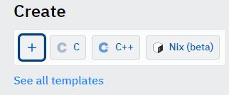
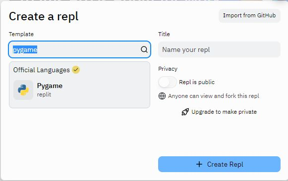
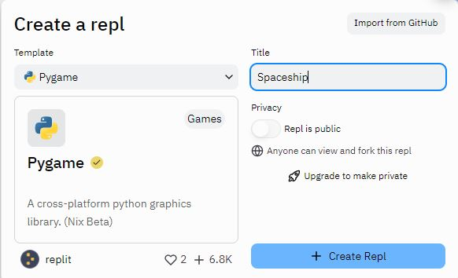
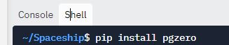
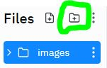
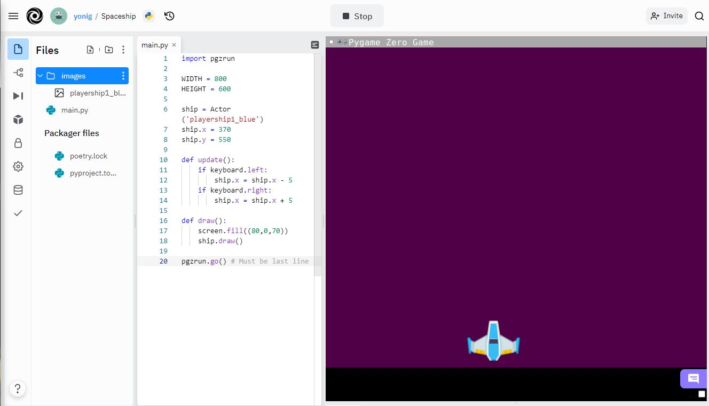

Using Replit
---

__[Replit](http://replit.com)__ is an in-browser IDE that supports many programming languages, including Python.  It also has special support for PyGame projects.

If you wish to use this PyGameZero Tutorial inside __[Replit](http://replit.com)__ you can follow this brief set of instructions:


1. Create an account
<br><br>

<br>

2. Create a new PyGame project
<br><br>
 
<br><br>
 
<br><br>
 
<br>

3. Click on the *Shell* tab and run: ```pip install pgzero```
<br><br>



4. Add folder *images*
<br><br>

<br>

5. Place whichever images you need for your game in the images directory

6. Write your code in the *main.py* file and **Run**

The first time you run the program it will take some time to resolve dependencies from the PyGameZero package.

NOTE: Make sure to size the Game Window to fit the entire game (max game area is 800x600)
<br><br>



