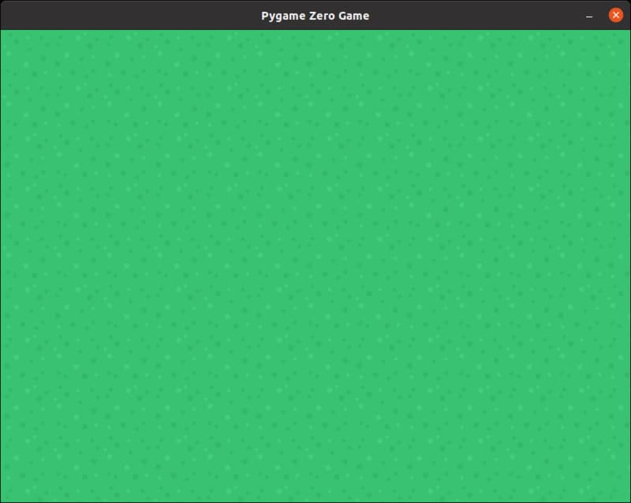

# Background Image

In the Ninja Runner game, we drew our background using the **filled_rect()** function. That's a simple way, but when we want a better looking background, it is better to use an image file for our background.

One thing we have to watch out for when using a background image, is that we need to make sure our background image is the same size as our game window. For this game, we have set our game window to 800 width and 600 height, so our background image needs to be the same. If you're using the **grass.png** image that I've provided, it will be the correct size.

## Code

First we need to create a new **Actor** using the background image file.

```python
background = Actor('grass')
```

Next we need to draw the actor, but we should only do that in the **draw()** function. We'll use ```def draw():``` to create the **draw()** function.

```python
def draw():
    background.draw()
```

Note that the ```background.draw()``` is indented. This tells Python that this line is inside the **draw()** function.

## At this point...

Right now your code should look like this (new lines are highlighted in yellow)...

```python hl_lines="6 8 9"
import pgzrun

WIDTH = 800
HEIGHT = 600

background = Actor('grass')

def draw():
    background.draw()

pgzrun.go() # Must be last line
```

Run this program by clicking **"Run -> Run Module"**. A window with the background image should appear.

