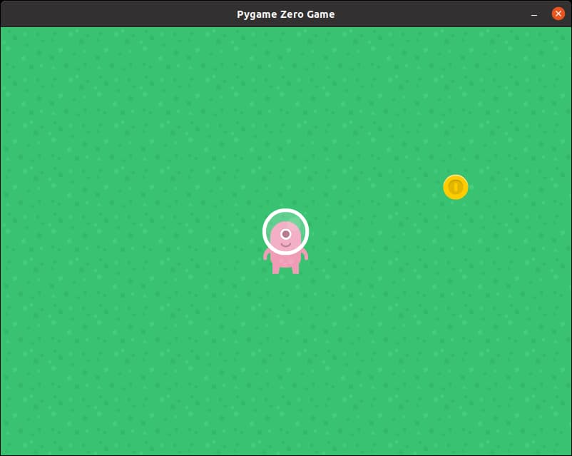

# Coin

You probably know what to do by now. Like before, we'll start by creating the **Actor** for the coin.

```
coin = Actor('coingold')
```

We'll also need to draw in in the **draw()** function.

```
coin.draw()
```

## Random position

We want our coin to start in a random position. To do that, we'll need the help of the **random** module. Let's start by importing this module.

```python
import random
```

This line should be placed at the top, just below ```import pgzrun```.

Since the width of our screen is 800, we want our coin to start with an **x** position that is somewhere between 0 to 800.

```python
coin.x = random.randint(0, 800)
```

And since the height of our screen is 600, we want our coin to start with an **y** position that is somewhere between 0 to 600.

```python
coin.y = random.randint(0, 600)
```

## At this point...

Right now your code should look like this (new lines are highlighted in yellow)...

```python hl_lines="2 13 14 15 30"
import pgzrun
import random

WIDTH = 800
HEIGHT = 600

background = Actor('grass')

player = Actor('p3_front')
player.x = 400
player.y = 300

coin = Actor('coingold')
coin.x = random.randint(0, 800)
coin.y = random.randint(0, 600)

def update():
    if keyboard.up:
        player.y -= 5
    if keyboard.down:
        player.y += 5
    if keyboard.left:
        player.x -= 5
    if keyboard.right:
        player.x += 5

def draw():
    background.draw()
    player.draw()
    coin.draw()

pgzrun.go() # Must be last line
```

Your game should now look like this...



Since the coin position is randomized, your coin may not appear in the same position as mine. Try closing and restarting the game a few times; you should see the coin appear in a different position each time.