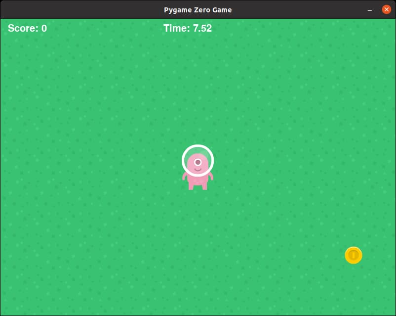

# Timer

We want to add a timer that counts down to zero. When the time is up, we'll end the game and display the score.

Create another global variable and start it to 10, representing 10 seconds, at the start of the game.

```python
timer = 10
```

Since the **update()** function runs 60 times per second, we will subtract 1/60<sup>th</sup> of a second in every **update()**. Since **timer** is a global variable, we'll need declare that it is global first.

```python
global timer

timer -= 1 / 60
```

## Display the Timer

Just like the score, we will use the ```screen.draw.text()``` function, but we'll draw the time in a different position. Again, this needs to be in **draw()**.

```python
screen.draw.text('Time: ' + str(timer), (330,10), color=(255,255,255), fontsize=30)
```


Ok. We got the timer now, but that's a lot of decimal places. Let's round the timer value to 2 decimal places before we convert it to a string. Change **str(timer)** into...

```python
str(round(timer, 2))
```



Much better now!

## At this point...

Right now your code should look like this (new lines are highlighted in yellow)...

```python hl_lines="18 22 24 45"
import pgzrun
import random

WIDTH = 800
HEIGHT = 600

background = Actor('grass')

player = Actor('p3_front')
player.x = 400
player.y = 300

coin = Actor('coingold')
coin.x = random.randint(0, 800)
coin.y = random.randint(0, 600)

score = 0
timer = 10

def update():
    global score
    global timer

    timer -= 1 / 60
    
    if keyboard.up:
        player.y -= 5
    if keyboard.down:
        player.y += 5
    if keyboard.left:
        player.x -= 5
    if keyboard.right:
        player.x += 5

    if player.colliderect(coin):
        coin.x = random.randint(0, 800)
        coin.y = random.randint(0, 600)
        score += 1

def draw():
    background.draw()
    player.draw()
    coin.draw()
    screen.draw.text('Score: ' + str(score), (15,10), color=(255,255,255), fontsize=30)
    screen.draw.text('Time: ' + str(round(timer, 2)), (330,10), color=(255,255,255), fontsize=30)

pgzrun.go() # Must be last line

```