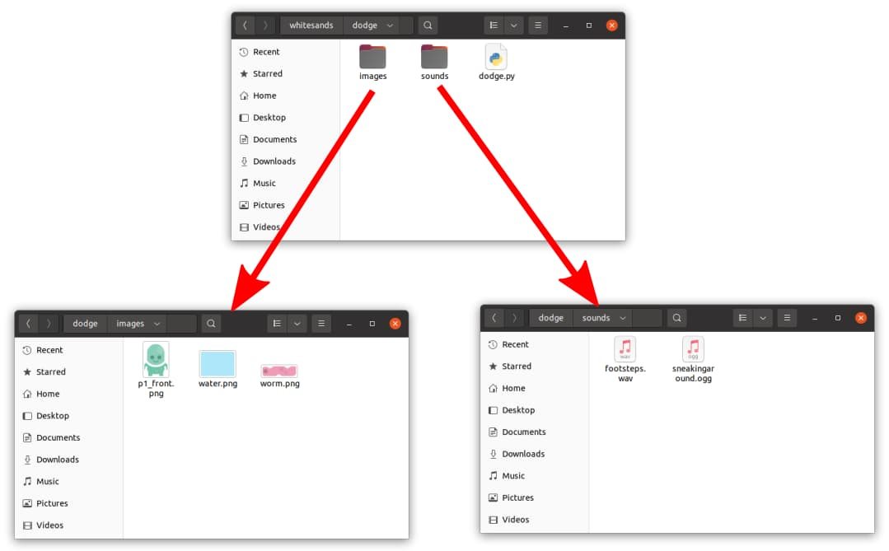
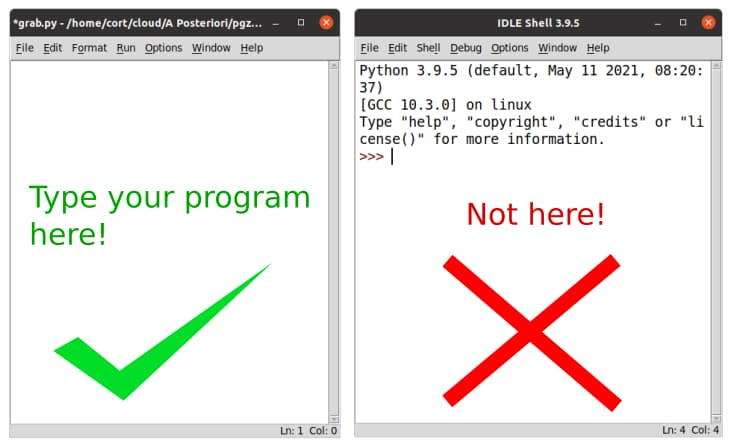

# Preparing the Files

For this game, we'll be using 3 images and 2 sound files. For your convenience, I have packed them all into a single zip file. [Click this link to download it.](../download/dodge.zip)

As always, you can use different images and sounds if you prefer. This is your game, so it's up to you! Either way, make sure to put the images in the **images** directory and the sound files in the **sounds** directory. Your folders should now look like this...



## Base Program

Now let's put in our base program. All of our Pygame Zero programs will need these 4 lines.

```python
import pgzrun

WIDTH = 800
HEIGHT = 600

pgzrun.go() # Must be last line
```

The first line, ```import pgzrun```, loads the Pygame Zero module, and the last line, ```pgzrun.go()```, is a function that starts Pygame Zero. In the middle we have ```WIDTH = 800``` and ```HEIGHT = 600``` which sets the width and height of the game window.

### IMPORTANT!

Be sure to type your program into your **dodge.py** window (...the window title says **dodge.py**), and not into the **IDLE Shell** window.

