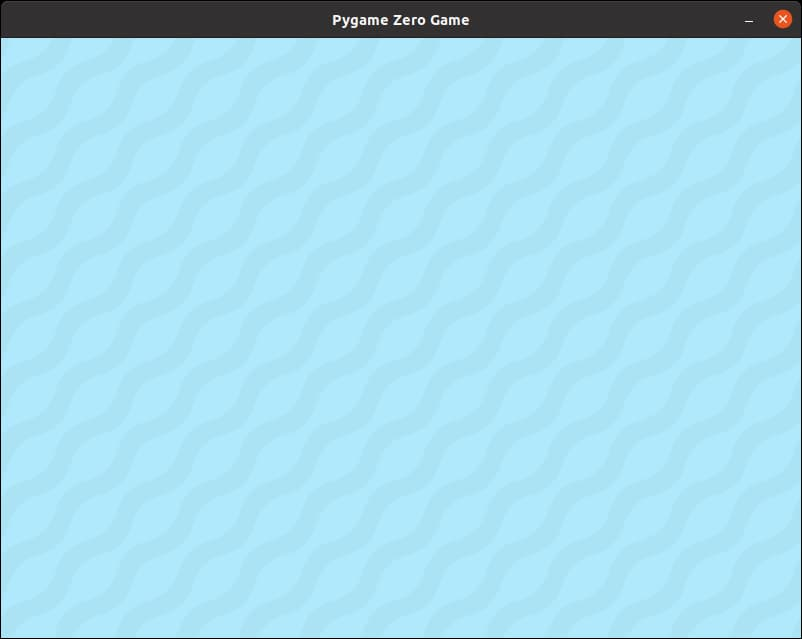

# Background Image

Just like in the **Grab the Coin** game, we will be using an image file for our background. This time, it's a water image.

It's fine if you want to use a different image, but as always, make sure your background image is the same size as the game window.

## Code

First we need to create a new **Actor** using the background image file.

```python
background = Actor('water')
```

Next we need to draw the actor, but we should only do that in the **draw()** function. We'll use ```def draw():``` to create the **draw()** function.

```python
def draw():
    background.draw()
```

Note that the ```background.draw()``` is indented. This tells Python that this line is inside the **draw()** function.

## At this point...

Right now your code should look like this (new lines are highlighted in yellow)...

```python hl_lines="6 8 9"
import pgzrun

WIDTH = 800
HEIGHT = 600

background = Actor('water')

def draw():
    background.draw()

pgzrun.go() # Must be last line
```

Run this program by clicking **"Run -> Run Module"**. A window with the background image should appear.

