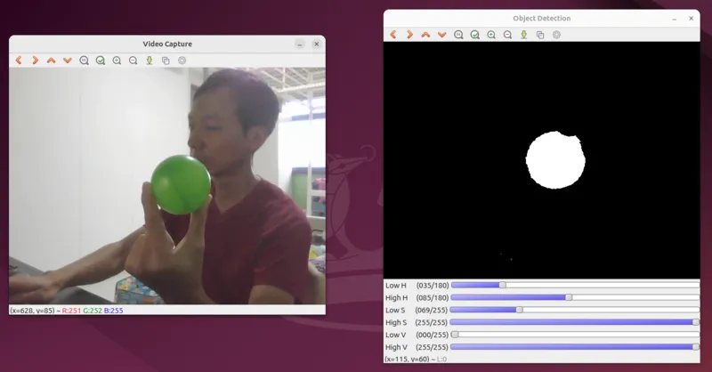
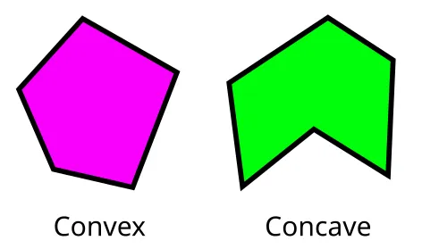
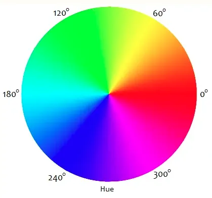

# Color Blob Detection

Color blob detection can be used to identify areas of an image with a common color or shape.
This is commonly used to track objects (eg. a robot that follows a red ball) or feature (eg. robot that follows a black line).

## Pre-requisites

* OpenCV needs to be installed. (Python version is used in this tutorial)
* Computer must have a camera.
* Circular object with a distinct color. (You can use other shapes, but the default parameters are tuned for circular objects, so it's easier to follow the tutorial if you have that)

## Process

There are 3 steps in this process...

1. Determining the color threshold. This is done before the actual color blob detection. In this step, we'll use a simple helper program to determine the color threshold values for the object we want to detect.
2. Thresholding. This extract out the colors that we want. After this step, the pixels that matches the color we want will become white, while the other pixels will become black.
3. Blob detection. This groups the pixels into blobs, filter them by size and shape, and provides us with their position and size.

## Determine Color Threshold

Load and run the example code from [this tutorial](https://docs.opencv.org/4.x/da/d97/tutorial_threshold_inRange.html).



Adjust the sliders until the object you want to detect is mostly white in the object detection window, while the background is mostly black.
Note down the values for the minimum and maximum HSV values.
In the above example, the ranges are H: 35-85, S: 69-255, V: 0-255.

<div class="info">
The camera captures images in RGB format, but it is hard to set thresholds for colors in RGB as differences in lighting will affect all three values.
In HSV, changes in lighting will affect the V value, while the H and S values remains largely unchanged.
You can also explore using other colorspaces, such as LAB.
Read <a href="https://learnopencv.com/color-spaces-in-opencv-cpp-python/">this article</a> to learn more about the different color spaces.
</div>

<div class="info">
The H value usually range from 0 to 360, but in OpenCV, the H value is halved (ie. range from 0 to 180) to fit within a single byte.
</div>

## Thresholding

In this step, we will extract out the colors we want.
The final output from this step is a black and white image, with white pixels in the areas which matches our target color and black pixels in the background.

We'll build the code bit by bit, starting with capturing and displaying an image.

```python
import cv2

cap = cv2.VideoCapture(0) # Change the number to select a different camera

while True:
    ret, frame = cap.read() # Grab one image frame from camera
    if frame is None:
        break

    cv2.imshow('result', frame) # Display the image in a window

    key = cv2.waitKey(30) # Wait 30ms for a key to be pressed
    if key == ord('q'): # If 'q' was pressed, exit the loop
        break
```

Run the above code.
You should see a window showing the view from the camera.
If you have multiple cameras, you can change the camera in use by changing the number in `cv2.VideoCapture(0)`.

In image processsing, it is often desirable to remove noise from the image.
These noise often appear as specs that pops in and out of view.
You can remove noise using a [filter in OpenCV](https://docs.opencv.org/4.x/d4/d13/tutorial_py_filtering.html).
The [Gaussian Blur](https://en.wikipedia.org/wiki/Gaussian_blur) is the most commonly used.

```python hl_lines="10"
import cv2

cap = cv2.VideoCapture(0) # Change the number to select a different camera

while True:
    ret, frame = cap.read() # Grab one image frame from camera
    if frame is None:
        break

    frame = cv2.GaussianBlur(frame, (5,5), 0) # Blur the image
    cv2.imshow('result', frame) # Display the image in a window

    key = cv2.waitKey(30) # Wait 30ms for a key to be pressed
    if key == ord('q'): # If 'q' was pressed, exit the loop
        break
```

The image should look a little more blurry compared to the earlier version.

The `(5,5)` in `cv2.GaussianBlur(frame, (5,5), 0)` is the kernel size in X and Y dimensions.
Try setting a larger kernel such as `(15,15)`, the image should look more blurry.
You can try other kernel sizes, but it must be a positive and odd number.

Next we'll convert the image into [HSV](https://en.wikipedia.org/wiki/HSL_and_HSV) format.

```python hl_lines="11"
import cv2

cap = cv2.VideoCapture(0) # Change the number to select a different camera

while True:
    ret, frame = cap.read() # Grab one image frame from camera
    if frame is None:
        break

    frame = cv2.GaussianBlur(frame, (5,5), 0) # Blur the image
    frame = cv2.cvtColor(frame, cv2.COLOR_BGR2HSV) # Convert to HSV
    cv2.imshow('result', frame) # Display the image in a window

    key = cv2.waitKey(30) # Wait 30ms for a key to be pressed
    if key == ord('q'): # If 'q' was pressed, exit the loop
        break
```

The image will look messed up!
This is because we have converted the image to HSV format, but `imshow` expects the image to be in RGB.
That's fine for now; we're not done yet.


```python hl_lines="3 4 5 6 7 8 19"
import cv2

low_H = 35
high_H = 85
low_S = 69
high_S = 255
low_V = 0
high_V = 255

cap = cv2.VideoCapture(0) # Change the number to select a different camera

while True:
    ret, frame = cap.read() # Grab one image frame from camera
    if frame is None:
        break

    frame = cv2.GaussianBlur(frame, (5,5), 0) # Blur the image
    frame = cv2.cvtColor(frame, cv2.COLOR_BGR2HSV) # Convert to HSV
    frame = cv2.inRange(frame, (low_H, low_S, low_V), (high_H, high_S, high_V))
    cv2.imshow('result', frame) # Display the image in a window

    key = cv2.waitKey(30) # Wait 30ms for a key to be pressed
    if key == ord('q'): # If 'q' was pressed, exit the loop
        break
```

Here we apply the threshold that we've obtained earlier.
After this step, all the pixels that are within the threshold will become white, while all other pixels will become black.


## Blob Detection

In this step, we'll setup the detection parameters and use `SimpleBlobDetector` to detect the blob.

```python hl_lines="10 11 12 13 14 15 16 28 29"
import cv2

low_H = 35
high_H = 85
low_S = 69
high_S = 255
low_V = 0
high_V = 255

params = cv2.SimpleBlobDetector_Params()
params.filterByColor = True
params.blobColor = 255 # Detect white blobs. If set to 0, it'll detect black blobs.
params.filterByArea = True
params.minArea = 1000
params.maxArea = 100000
detector = cv2.SimpleBlobDetector_create(params)

cap = cv2.VideoCapture(0) # Change the number to select a different camera

while True:
    ret, frame = cap.read() # Grab one image frame from camera
    if frame is None:
        break

    frame = cv2.GaussianBlur(frame, (5,5), 0) # Blur the image
    frame = cv2.cvtColor(frame, cv2.COLOR_BGR2HSV) # Convert to HSV
    frame = cv2.inRange(frame, (low_H, low_S, low_V), (high_H, high_S, high_V))
    keypoints = detector.detect(frame) # Detects keypoints. Each keypoint will contain the x,y position, and size.
    frame = cv2.drawKeypoints(frame, keypoints, 0, (0,0,255), cv2.DRAW_MATCHES_FLAGS_DRAW_RICH_KEYPOINTS)
    cv2.imshow('result', frame) # Display the image in a window

    key = cv2.waitKey(30) # Wait 30ms for a key to be pressed
    if key == ord('q'): # If 'q' was pressed, exit the loop
        break
```

Try out the code and position your object in view of the camera.
You should see a red circle drawn around your object.
Note that by default, `SimpleBlobDetector` will only detect circular blobs; if you have a non-circular object, it won't be detected here.

Next, we'll introduce more parameters.
This will allow us to detect blobs of different shapes.

```python hl_lines="16 17 18 19 20 21"
import cv2

low_H = 35
high_H = 85
low_S = 69
high_S = 255
low_V = 0
high_V = 255

params = cv2.SimpleBlobDetector_Params()
params.filterByColor = True
params.blobColor = 255 # Detect white blobs. If set to 0, it'll detect black blobs.
params.filterByArea = True
params.minArea = 1000
params.maxArea = 100000
params.filterByCircularity = False
params.minCircularity = 0.1
params.filterByConvexity = False
params.minConvexity = 0.87
params.filterByInertia = False
params.minInertiaRatio = 0.01
detector = cv2.SimpleBlobDetector_create(params)

cap = cv2.VideoCapture(0) # Change the number to select a different camera

while True:
    ret, frame = cap.read() # Grab one image frame from camera
    if frame is None:
        break

    frame = cv2.GaussianBlur(frame, (5,5), 0) # Blur the image
    frame = cv2.cvtColor(frame, cv2.COLOR_BGR2HSV) # Convert to HSV
    frame = cv2.inRange(frame, (low_H, low_S, low_V), (high_H, high_S, high_V))
    keypoints = detector.detect(frame) # Detects keypoints. Each keypoint will contain the x,y position, and size.
    frame = cv2.drawKeypoints(frame, keypoints, 0, (0,0,255), cv2.DRAW_MATCHES_FLAGS_DRAW_RICH_KEYPOINTS)
    cv2.imshow('result', frame) # Display the image in a window

    key = cv2.waitKey(30) # Wait 30ms for a key to be pressed
    if key == ord('q'): # If 'q' was pressed, exit the loop
        break
```

**Circularity** This measures how circular the blob is. A perfect circle will have a circularity of 1.

**Convexity** This measures how convex the shape is. See below for examples of convex and concave shapes.



**Inertia** This measures how elogated a shape is.
Eg. A circle will have an inertia ratio of 1, an ellipse will be less than 1, and a thin long rectangle will be close to 0.

Finally, we'll find the largest keypoint and print out its x,y position.

```python hl_lines="35 36 37 38 39 40 41 42"
import cv2

low_H = 35
high_H = 85
low_S = 69
high_S = 255
low_V = 0
high_V = 255

params = cv2.SimpleBlobDetector_Params()
params.filterByColor = True
params.blobColor = 255 # Detect white blobs. If set to 0, it'll detect black blobs.
params.filterByArea = True
params.minArea = 1000
params.maxArea = 100000
params.filterByCircularity = False
params.minCircularity = 0.1
params.filterByConvexity = False
params.minConvexity = 0.87
params.filterByInertia = False
params.minInertiaRatio = 0.01
detector = cv2.SimpleBlobDetector_create(params)

cap = cv2.VideoCapture(0) # Change the number to select a different camera

while True:
    ret, frame = cap.read() # Grab one image frame from camera
    if frame is None:
        break

    frame = cv2.GaussianBlur(frame, (5,5), 0) # Blur the image
    frame = cv2.cvtColor(frame, cv2.COLOR_BGR2HSV) # Convert to HSV
    frame = cv2.inRange(frame, (low_H, low_S, low_V), (high_H, high_S, high_V))
    keypoints = detector.detect(frame) # Detects keypoints. Each keypoint will contain the x,y position, and size.
    largest_size = 0
    largest_keypoint = None
    for keypoint in keypoints:
        if keypoint.size > largest_size:
            largest_size = keypoint.size
            largest_keypoint = keypoint
    if largest_keypoint:
        print(largest_keypoint.pt)
    frame = cv2.drawKeypoints(frame, keypoints, 0, (0,0,255), cv2.DRAW_MATCHES_FLAGS_DRAW_RICH_KEYPOINTS)
    cv2.imshow('result', frame) # Display the image in a window

    key = cv2.waitKey(30) # Wait 30ms for a key to be pressed
    if key == ord('q'): # If 'q' was pressed, exit the loop
        break
```

## Troubleshooting

**How to deal with false positives?**

* Increase Gaussian Blur
* Set a narrower HSV range
* Set a narrower range for filterByArea
* Turn on and set a narrower range for filterByCircularity / filterByConvexity / filterByInertia

**How to set a threshold for red?**

The HSV color space is cylindrical, and the H (Hue) is an angle around this cylinder.
This means that a H value of 0 deg, is the same as a H value of 360 deg.



In HSV, red is both 0 and 360 deg (...0 to 180 in OpenCV as OpenCV halves the H value).
So if you want to detect red, you'll want a range of say 0 to 10 **AND** 170 to 180.
But this won't work with OpenCV's `inRange`, as it accepts only a single contiguous range.

One solution is to use another color space (eg. LAB or YUV).
In these color spaces, none of the values wraps around back to zero, so you won't have this problem.

Another solution is to change this line... `frame = cv2.cvtColor(frame, cv2.COLOR_BGR2HSV)` ...into this... `frame = cv2.cvtColor(frame, cv2.COLOR_RGB2HSV)`.
This basically swaps the Red and Blue values when performing the HSV conversion.
Your red will now have the H value of Blue; around 240 degs (...or 120 in OpenCV), and you can now use a H range of 230 to 250 with `inRange`.

**How to detect silver reflective objects?**

Silver isn't actually a color.
A silver reflective surface is simply one that acts like a mirror, reflecting the light around it, and can appear as any color.

Since you can't detect a silver object by color, you'll need to rely on other properties.
Consider what happens when you shine a bright light on a silver object?
How does it appear compared to a matt object?

You can also explore the use of other filters (eg. Canny, Sobel) and see if you can make the silver object stand-out from the background.

**How to display in fullscreen?**

Add...

```python
cv2.namedWindow('result', cv2.WINDOW_NORMAL)
cv2.setWindowProperty('result', cv2.WND_PROP_FULLSCREEN, cv2.WINDOW_FULLSCREEN)
```

...to your code.
This should be before the `while` loop.