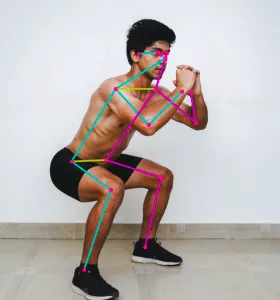

# Movenet

[Movenet](https://www.tensorflow.org/hub/tutorials/movenet) is a machine learning model that detects 17 keypoints of a body from an image or video.



You can use it for various purposes, such as...

* Control a robot to mimic a human pose
* Pilot a drone using body movement
* Create an exercise app that can count push-ups, detect yoga poses, etc

## Capabilities

Movenet can run at 30+ FPS on most modern computers, and can detect the following keypoints...

| Keypoint | S/N |
| --- | --- |
| nose | 0 |
| left_eye | 1 |
| right_eye | 2 |
| left_ear | 3 |
| right_ear | 4 |
| left_shoulder | 5 |
| right_shoulder | 6 |
| left_elbow | 7 |
| right_elbow | 8 |
| left_wrist | 9 |
| right_wrist | 10 |
| left_hip | 11 |
| right_hip | 12 |
| left_knee | 13 |
| right_knee | 14 |
| left_ankle | 15 |
| right_ankle | 16 |

Given a image or video, Movenet will output the (x, y) coordinates of each of theses points (...provided they are visible in the image).

## Limitations

Movenet **cannot** detect hand poses (eg. hands open or closed).
It also cannot detect mouth, fingers, toes, etc. If needed, there are other models which can detect those.

## Installation

To use Movenet, you will need to install a few libraries...

### TensorFlow
This is the software library for machine learning.
Follow the installation instructions here...

https://www.tensorflow.org/install/pip

### TensorFlow_hub
Used for loading the Movenet model.
In a terminal, run...

```
pip install -q tensorflow_hub
```

### OpenCV
This is a computer vision library for processing the image.
In a terminal, run...

```
pip install -q opencv-python
```

## Model Types

Movenet provides two models...

### Thunder
Higher accuracy, lower performance.
You can download it here...

https://tfhub.dev/google/movenet/singlepose/thunder/4

Note that **Thunder** expects the input image to be 256x256.

### Lightning
Lower accuracy, higher performance.
You can download it here...

https://tfhub.dev/google/movenet/singlepose/lightning/4

Note that **Lightning** expects the input image to be 192x192.

### Unpacking

You should extract the downloaded files into their own folder.
In the examples below, it is assumed that the **Thunder** model files are extracted into a directory named **movenet_singlepose_thunder_4**, and the **Lightning** model files are extracted into a directory named **movenet_singlepose_lightning_4**.

## Code (Display Only)

The code for using Movenet is rather complex, so we'll be breaking it up into multiple small steps.
In this first step, we'll be using OpenCV to capture a video image and display it; there's actually no usage of Movenet here.

```python
import cv2

cap = cv2.VideoCapture(0)

success, img = cap.read()

while success:
    cv2.imshow('Movenet', img)

    if cv2.waitKey(1) == ord("q"):
        break

    success, img = cap.read()

cap.release()
```

**import cv2** : Imports the OpenCV module.

**cap = cv2.VideoCapture(0)** : Open camera 0 for video capture. If you have more than one camera, you can change this number to select a different camera.

**success, img = cap.read()** : Capture one image frame from the camera. It will return a `success` value indicating if it was successful, and the actual image `img`.

**cv2.imshow('Movenet', img)** : Displays the image on screen.

**if cv2.waitKey(1) == ord("q"):** : Checks if the "q" button was pressed. If it was, break out of the while loop. **IMPORTANT: The previous `imshow` will not work without this `waitKey`**.

**cap.release()** : Release the camera, allowing other programs to use it.

## Code (Process Image)

In this example, we'll process the captured image to make it fit within the size that Movenet expects.
Note that **Thunder** expects a 256x256 image, while **Lightning** expects 192x192.
We are still not doing any Movenet detection yet.

```python hl_lines="1 3 10 11 12 14 15"
import tensorflow as tf
import cv2
import numpy as np

cap = cv2.VideoCapture(0)

success, img = cap.read()

while success:
    tf_img = cv2.resize(img, (256,256))
    tf_img = cv2.cvtColor(tf_img, cv2.COLOR_BGR2RGB)
    tf_img = np.asarray(tf_img)

    image = np.expand_dims(tf_img,axis=0)
    image = tf.cast(image, dtype=tf.int32)

    cv2.imshow('Movenet', img)

    if cv2.waitKey(1) == ord("q"):
        break

    success, img = cap.read()

cap.release()
```

**import tensorflow as tf** : Imports the TensorFlow module.

**import numpy as np** : Imports the numpy module. This module is commonly used on Python for data processing.

**tf_img = cv2.resize(img, (256,256))** : Resize the image to 256x256. If you're using **Lightning**, you'll need to change this to 192x192.

**tf_img = cv2.cvtColor(tf_img, cv2.COLOR_BGR2RGB)** : Change the color format. By default, it is in Blue-Green-Red (BGR), and we'll need to change it to RGB to suit Movenet.

**tf_img = np.asarray(tf_img)** : Converts the image into an numpy array.

**image = np.expand_dims(tf_img,axis=0)** : This adds a dimension to the image data. It's required for Movenet.

**image = tf.cast(image, dtype=tf.int32)** : This converts the image data into int32 format. It's required for Movenet.

<div class="info">
You can change the "imshow" to display "tf_img" instead of the original "img". It'll look smaller, and the colors will look wrong, but that's how Movenet expects it.
</div>

## Code (Single Keypoint Only)

In this example, we'll print out the position of a single keypoint (left eye).
Note that the position is **normalized** (ie. the leftmost position is 0, the rightmost is 1.0, and the middle is 0.5).

```python hl_lines="2 6 7 21 22 23"
import tensorflow as tf
import tensorflow_hub as hub
import cv2
import numpy as np

model = hub.load('movenet_singlepose_thunder_4')
movenet = model.signatures['serving_default']

cap = cv2.VideoCapture(0)

success, img = cap.read()

while success:
    tf_img = cv2.resize(img, (256,256))
    tf_img = cv2.cvtColor(tf_img, cv2.COLOR_BGR2RGB)
    tf_img = np.asarray(tf_img)

    image = np.expand_dims(tf_img,axis=0)
    image = tf.cast(image, dtype=tf.int32)

    outputs = movenet(image)
    keypoints = outputs['output_0']
    print(keypoints[0,0,1])

    cv2.imshow('Movenet', img)

    if cv2.waitKey(1) == ord("q"):
        break

    success, img = cap.read()

cap.release()
```

**import tensorflow_hub as hub** : The `tensorflow_hub` module is used to help load the Movenet model.

**model = hub.load('movenet_singlepose_thunder_4')** : This loads the **Thunder** model into the variable `model`. You can alternatively use **Lightning** here.

**movenet = model.signatures['serving_default']** : Loads movenet.

**outputs = movenet(image)** : Loads the image into Movenet. It will then return the keypoints. Note that it will always return 17 keypoints, even if some of them are not visible.

**keypoints = outputs['output_0']** : Extract the output. There is only one output ('output_0') from Movenet.

**print(keypoints[0,0,1])** : Prints out the position of the **left eye** (...s/n 1). Note that the format is **y, x, confidence**. If you want to display a different keypoint, change the last number.

<div class="important">
keypoints is a Tensor, and not a list, hence the strange looking index.
</div>

Run the program, then try moving around and see how the numbers change.
What happens to the confidence level when the keypoint is not in view of the camera?

## Code (Mark Keypoints)

In this example, we'll mark out the position of the keypoints on screen.
This is great for visualizing the Movenet results, but it is not strictly necessary if you just need to control a robot or drone.

```python hl_lines="13 26 27 28 29 31"
import tensorflow as tf
import tensorflow_hub as hub
import cv2
import numpy as np

model = hub.load('movenet_singlepose_thunder_4')
movenet = model.signatures['serving_default']

cap = cv2.VideoCapture(0)

success, img = cap.read()

h, w, _ = img.shape

while success:
    tf_img = cv2.resize(img, (256,256))
    tf_img = cv2.cvtColor(tf_img, cv2.COLOR_BGR2RGB)
    tf_img = np.asarray(tf_img)

    image = np.expand_dims(tf_img,axis=0)
    image = tf.cast(image, dtype=tf.int32)

    outputs = movenet(image)
    keypoints = outputs['output_0']

    for k in keypoints[0,0,:,:]:
        if k[2] > 0.3:
            yc = int(k[0] * h)
            xc = int(k[1] * w)

            img = cv2.circle(img, (xc, yc), 2, (0, 255, 0), 5)

    cv2.imshow('Movenet', img)

    if cv2.waitKey(1) == ord("q"):
        break

    success, img = cap.read()

cap.release()
```

**h, w, _ = img.shape** : Get the height and width of the original image.

**for k in keypoints[0,0,:,:]:** : Iterates through the 17 keypoints.

**if k[2] > 0.3:** : Check if the confidence level is greater than 0.3; if it's too low, it may be a false result. You can change this threshold to suit your needs.

**yc = int(k[0] * h)** : Multiply normalized (0 to 1.0) y coordinate of the keypoint by the height of the image to get it's y position.

**xc = int(k[1] * w)** : Same as before, but for width.

**img = cv2.circle(img, (xc, yc), 2, (0, 255, 0), 5)** : Draw a circle at the keypoint position.

## Code (Compare and Scale)

If you plan to use Movenet to control something, you will often need to compare the position of two or more keypoints, and scale the result so that you can have a consistent result regardless of whether you are near or far from the camera.

This example demonstrates how to control an onscreen ball using movement from your right arm.
It compares the x position of your **right wrist** to your **right elbow** to determine the position of the ball.
It also scales the value against the distance between your **right elbow** and your **right shoulder**.

For this example to work right, you should keep your entire right arm in view of the camera, and your elbow should stay directly below your shoulder.

```python hl_lines="26 27 28 30 31 32 33 35"
import tensorflow as tf
import tensorflow_hub as hub
import cv2
import numpy as np

model = hub.load('movenet_singlepose_thunder_4')
movenet = model.signatures['serving_default']

cap = cv2.VideoCapture(0)

success, img = cap.read()

h, w, _ = img.shape

while success:
    tf_img = cv2.resize(img, (256,256))
    tf_img = cv2.cvtColor(tf_img, cv2.COLOR_BGR2RGB)
    tf_img = np.asarray(tf_img)

    image = np.expand_dims(tf_img,axis=0)
    image = tf.cast(image, dtype=tf.int32)

    outputs = movenet(image)
    keypoints = outputs['output_0']

    shoulder = keypoints[0,0,6]
    elbow = keypoints[0,0,8]
    wrist = keypoints[0,0,10]

    upper_arm_length = ((shoulder[0] - elbow[0])**2 + (shoulder[1] - elbow[1])**2) ** 0.5
    x_pos = wrist[1] - elbow[1]
    x_pos = x_pos / upper_arm_length
    x_pos = int((x_pos * w + w) / 2)

    img = cv2.circle(img, (x_pos, h/2), 2, (0, 255, 0), 5)

    cv2.imshow('Movenet', img)

    if cv2.waitKey(1) == ord("q"):
        break

    success, img = cap.read()

cap.release()
```

**upper_arm_length = ((shoulder[0] - elbow[0])\*\*2 + (shoulder[1] - elbow[1])\*\*2) \*\* 0.5** : Calculates the length of the upper arm using Pythagoras' theorem.

**x_pos = wrist[1] - elbow[1]** : Calculate x position of wrist, relative to the elbow. We want the wrist position to be relative to the elbow, so that the result won't be affected by your position in the camera.

**x_pos = x_pos / upper_arm_length** : Scale the result by the upper arm length. This ensures that the result is not affected by your distance to the camera.

**x_pos = int((x_pos * w + w) / 2)** : Calculate the x position to draw the ball. Basically, we scale it by the image width, then add width to it and divide by 2 to ensure that the ball is at the center of the screen when the wrist is at the zero position.

**img = cv2.circle(img, (x_pos, h/2), 2, (0, 255, 0), 5)** : Draw the circle. We don't care about the y position in this exercise, so we'll just set it to half the height.

