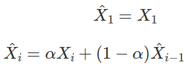

# Signal Filters

The data we receive from sensors are often noisy.
This means that while the **average** values are often pretty accurate, each individual value may be off by quite a bit.
Such errors are often called **jitter**.

To give an example, if you place a distance sensor at a fixed 1m distance from a wall, you may get readings like...

```
0.97
1.04
0.98
1.01
1.02
0.98
.
.
.
```

The average reading is pretty good, but the values are changing all the time even though the distance didn't actually change.

To deal with this problem, we can take the average value, but this reduces your reading rate.
Eg. If your sensor reads 10 times per second, and you use the average of 10 readings, you'll only have one useful value every second.

# Low Pass Filters

As the errors from jitter are often changing very rapidly (high frequency), we can also use a [Low Pass Filter](https://en.wikipedia.org/wiki/Low-pass_filter) to block out the noise, while allowing the actual signal (low frequency) to pass through.

One simple equation that we can use is...



...where X̂i is the filtered output, Xi is the current input value (...from sensor), and X̂(i-1) is the previous filtered output.

α is a value between 0 to 1, and is called the weight.

* High α : Respond faster, but more noise (jitter)
* Low α : Less noise, but respond slower (laggy)

In Python, the above can be implemented as...


```python
alpha = 0.5
filtered_output = 0

def low_pass(in_val):
    global filtered_output

    filtered_output = alpha * in_val + (1 - alpha) * filtered_output

    return filtered output

# Example usage
while True:
    sensor_reading = some_sensor_reading_function() # Replace with actual code
    out_val = low_pass(sensor_reading)
    print(out_val)
```

# One Euro Filter

An improvement to the above low pass filter would be the [1€ Filter](https://gery.casiez.net/1euro/).
This filter works in the same way as the low pass filter example code, but instead of having a fixed alpha, it automatically adjust alpha to reduce jitter at low speed and improve responds at high speed.

1. Open the code for the filter from [here](https://raw.githubusercontent.com/jaantollander/OneEuroFilter/master/python/one_euro_filter.py).
2. Right click, select "Save as...", then save the file to the same directory as your Python code.
3. Import and use the filter in your code.

## Sample code

```python
from one_euro_filter import OneEuroFilter
from time import time

one_euro_filter = OneEuroFilter(
    time(),
    0,
    min_cutoff=0.5,
    beta=0.3
)

# Example usage
while True:
    sensor_reading = some_sensor_reading_function() # Replace with actual code
    out_val = one_euro_filter(time(), sensor_reading)
    print(out_val)
```