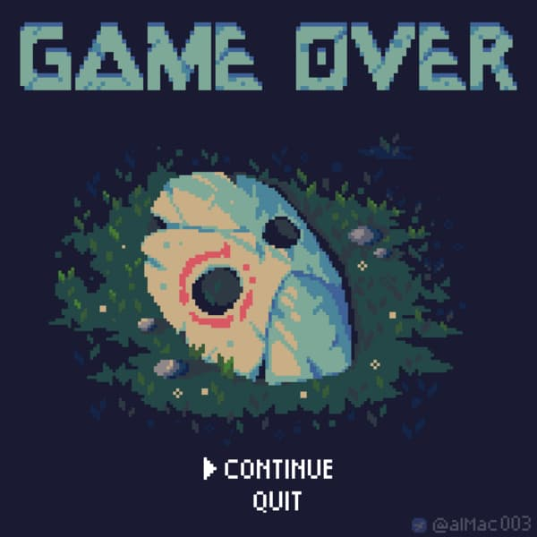
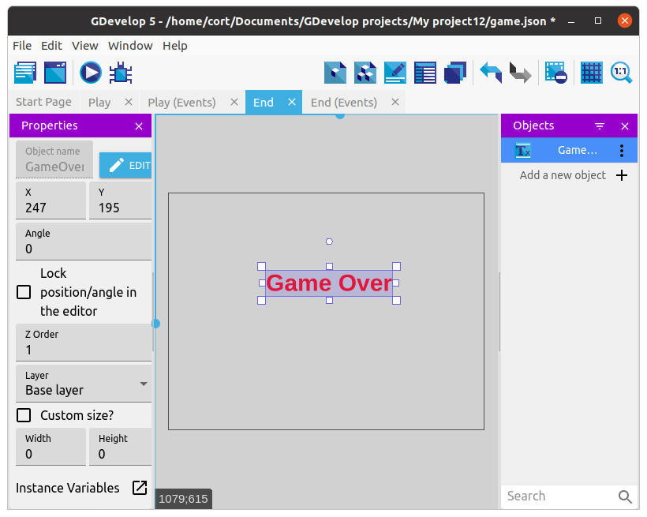

# Game Over

Right now, nothing happens when the player touches the enemy.
We can detect the collision between the player and enemy easily using an event, but what should happen when they collide?

Let's start by build a game over scene.

Click on the **Project Manager** button and add a new scene.
Name the new scene **End**, then click on it to open it.

# Multiple Scenes

In GDevelop, you can have multiple scenes, and switch between them during the game using actions.
Typically, you will have at least one scene for the starting screen, one for the actual game play, and one for game over.

# Text Object

For a professional looking game, you would want to draw a nice **Game Over** graphics and use that in your game...

...but since those using the web-editor can't add in their own images, and I'll like to keep this tutorial accessible for everyone, I'm just going to print out the words **Game Over** in big bold letters.

Add a new object, click on **New object from scratch**, then select **Text**.
Set the font size, color, bold, and type in **Game Over** in the **Initial text**.
You may also want to give the new object an appropriate name.

Drag a new instance of the text object and position it on the **End** scene.

