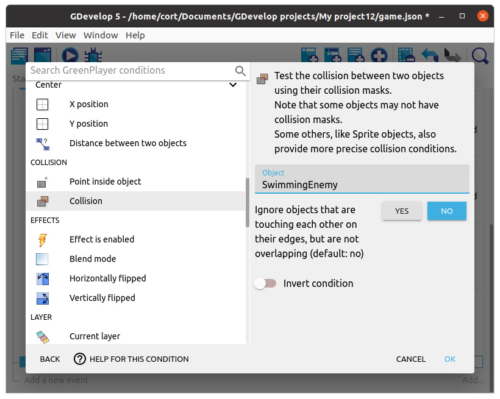
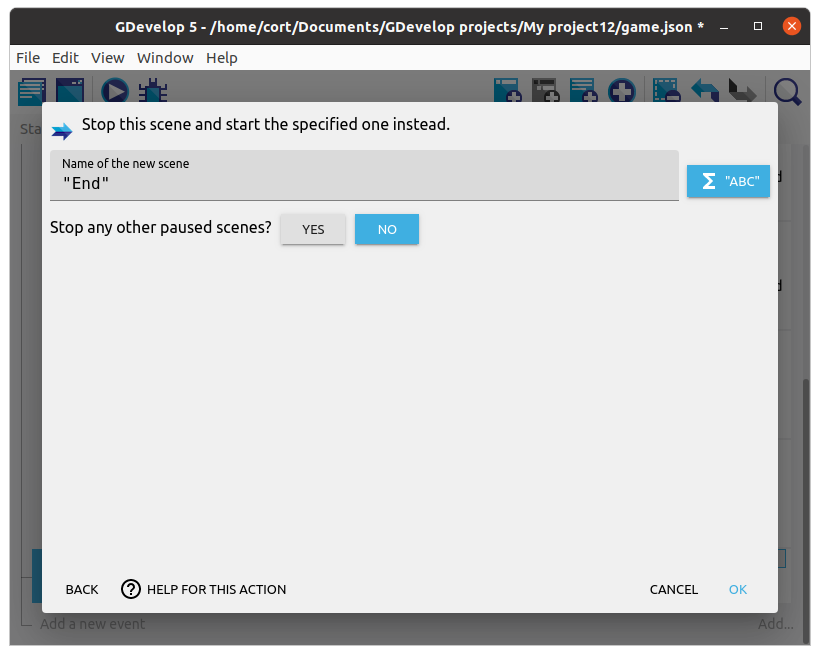

# Collision

Switch back to the **Play** scene.
We'll add in a event that detects if the player is touching an enemy.
If they are touching, we'll switch to the **End** scene.

Add a new event, **Add condition**, click on the player, then select the collision condition.
Under **Object**, choose the **Enemy**.

Now add an action, click **Other actions**, then select the **Change scene** action.
Under **Name of the new scene**, type in **"End"** (...including the quotes).

Make sure you are in the **Play** scene, then click the preview button to test your game.
Now when you touch an enemy, it should switch to the end scene.

*If you are in the **End** scene, clicking the preview button will only display that scene.*