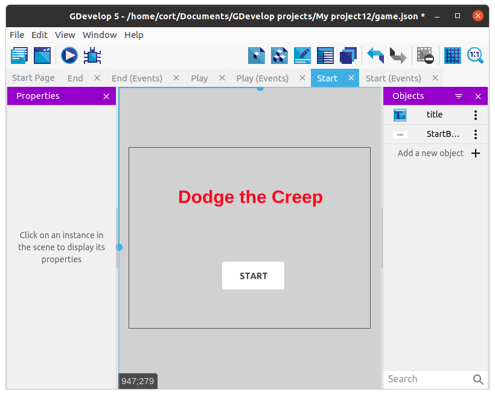
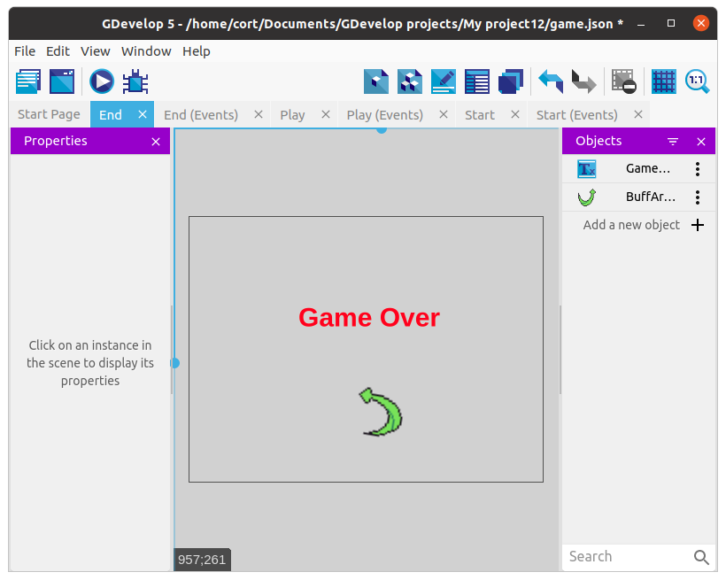

# Start Scene

Now that we have a game over scene, let's also create a start scene.

Create a new scene and rename it **Start**.
Move the scene to the top of the scene list.

**IMPORTANT** When you run a game that has been exported, it will always start the first scene in the list.
Since we want our game to start with the start scene, we need to make sure it is the first scene in the list.

Now add a **title** and a **start button** to the game.

* Title: This is a text object.
* Start button: This is from the asset store.

We need to add an event to make the start button work.

Add a new event, **Add condition**, click the start button, then select the **Cursor/touch is on an object** condition.

To the same event, add a second condition, this time select **Other conditions**, and choose the **Mouse button released** condition.
Under **Button to check**, choose the **Left** button.

**Note** You may notice that for the arrow controls, we used **Touch or mouse button is down**, but here we are using **Mouse button released**.
That's because in game movement controls, we usually make a character move when we hold a button down.
But for other types of controls (eg. selecting options from a menu), we usually trigger the button when the click or touch is released.

Under actions, select **Change to scene** and select the **Play** scene.

## Restarting After Game Over

We should also add in a button to let us restart the game after game over.

Add an image for the restart button.
I'm using this one...

Add in an event to switch to the **Start** scene when the restart button is clicked...

## What's Next?

Now we have all the essential elements of a game.
If you have a great idea on how you can progress from here, go ahead and try it out on your own.
Else you can continue on to the next few sections, where will cover some added features:

* Score
* Sound and Music
* Increasing difficulty