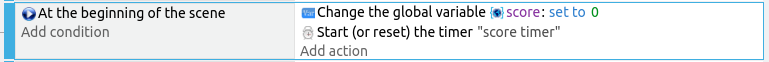
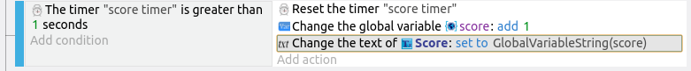

# Score

For this game, the objective is to stay alive as long as possible.
So for the score, we'll increment it by 1 point every second.

In the **Play** scene, add a new **Text** object, set the initial text to **0**, and the font size and color to whatever you want.
Name the object **Score**.
Drag a new instance and place it in the top center of the screen.

We'll need to create a variable to store the score, and an event to update the score.

First, create a new event, and for the condition, select **At the beginning of the scene**.
For the conditions, select **Value of a global variable**.
Set the variable name to **score**, and set it to **0**.
We should also start a new timer which we will name **score timer**.

This will set the global variable **score** to a value of zero at the start of the **Play** scene.
Note that we are using a **global** variable here.
Global means that this variable will be accessible in all of the scenes.
If you use a **scene** variable, that variable will not be accessible anymore if you change scene.

Next, we'll need to increase the **score** variable by 1 every second, and update the score display that's on screen.

Add another new event, and for the condition, select **Value of scene timer**.
Set the time to 1 second, and the timer name to **"score timer"** (...including quotes).

Next we have 3 actions to add...

1. **Reset the timer** and set the timer name to **"score timer"**.
2. **Value of a global variable**, set the variable to **score**, the operator to **add**, and the value to **1**.
3. **Modify the text**, make sure the **Score** object is selected first, and set the value to **GlobalVariableString(score)**.

## Display Score in Game Over Scene

We also want to display our score in the game over screen.

Add a new **Text** object in the game over scene and rename it to **Score**.
Set the font, color, and size, and drag an instance on to the scene.
For the initial text, type in **Your score is ** (...make sure to leave an extra space at the end).

Add a new event, and for the condition, select **At the beginning of the scene**.
For the action, select the **Score** object, then choose **Modify the text**.
Set the **modification's sign** to **+ (add)**, and under value, use **GlobalVariableString(score)**.

## Testing

Click the preview button to test your game.
It should add one to your score ever second, and display your final score at the end of the game.