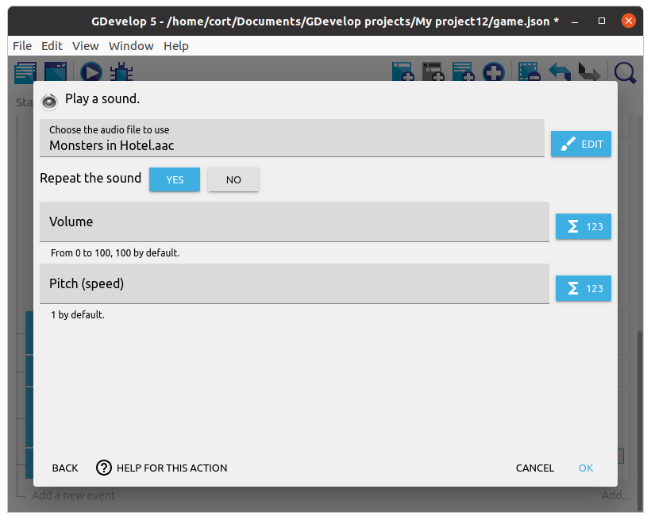
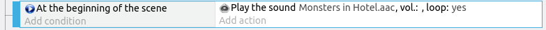
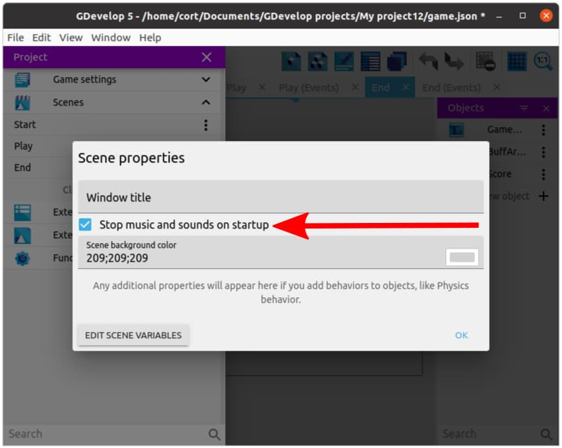

# Sound and Music

Let's add a background music to our **Play** scene.

**IMPORTANT** When running on a browser, the user must interact with the game (eg. click on the screen) before the first sound/music is played.
This is a limitation imposed by the browser to prevent annoying websites from blaring loud sounds at you as soon as you open the webpage.

To play a sound, we'll use either the **Play Music** or **Play Sound** actions.
Use **Play Music** if it is a long file such as a background music, and **Play Sound** if it is a short one like for a gunshot sound.

**TIPS** If in doubt, use **Play Sound**; while it's intended for short sounds, it actually works well for audio of any length.

Add a new event. Add the condition **At the beginning of the scene**. Add the condition **Play the sound**, select a music that you like, and set **Repeat** to **Yes**.

Your event should look like this...

If you like, you can add a background music for the **End** scene in the same way.
Note that if you add a background music for the **Start** scene, it will **NOT** play when you start the game in a browser, as the browser will not allow a webpage to play audio before the user interacts with it.

**OPTIONAL** When game over occurs, the music will automatically stop.
That's because by default, GDevelop stops all music and sounds when starting a new scene.
If you want the music to continue playing, open the **Project** manager, click on the 3 dots (...that's called a kebab menu) next to the **End** scene, select **Edit scene properties**, and turn off **Stop music and sounds on startup**.

