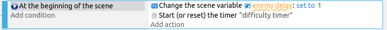

# Increasing Difficulty

Right now, the game is pretty easy and the difficulty level never changes.
Let's make it more of a challenge by increasing the difficulty level of the game as time passes.

One way to increase the difficulty is to decrease the delay between each enemy.
Currently, this is fixed at 1 second.
We'll change that **1** into a variable, and we'll reduce that variable every few seconds.

Open up the **Play** events tab and look for the event where we wait for the **enemy timer** to reach 1 second.
It should look like this...

We'll change the **1** into a variable.
Easiest way to do this is to double click on the timer condition to edit it, delete the **1**, then click on the blue **Expressions** button, and select **Value of a scene variable**.

Use the variable name **enemy delay** (...as always, there's nothing special about this variable name. Use whatever you want.)

We need to give **enemy delay** a starting value, else it'll be undefined at the start of the scene (...in GDevelop, an undefined variable will default to 0).
Add a new event with the **At the beginning of the scene** condition, and the **Change scene variable enemy delay set to 1** action.
Like this...

Now we need to reduce **enemy delay** every few seconds (...I'm gonna go with 5 seconds, but it's up to you).
We'll add a new event, with a timer condition like this...

Next, we'll add two actions; a **Reset the timer** action, and a **Value of scene variable** action.
In the **Value of scene variable** action, I'll modify the **enemy delay** variable by multiplying it by **0.9**.

The event should end up like this...

**THINK...** Why multiply by 0.9? When reducing a value, we would usually think of performing a subtraction, say by **0.1 seconds**.
But consider what happens when we have subtracted ten times?
The delay will now be **0 seconds**.
And if we subtract one more time, the delay will be **-0.1 seconds**. That doesn't make much sense!
Multiplying by 0.9 will reduce the delay, while ensuring that it never reaches zero.
There are other more complicated equations that we can use, but this is good enough for now.