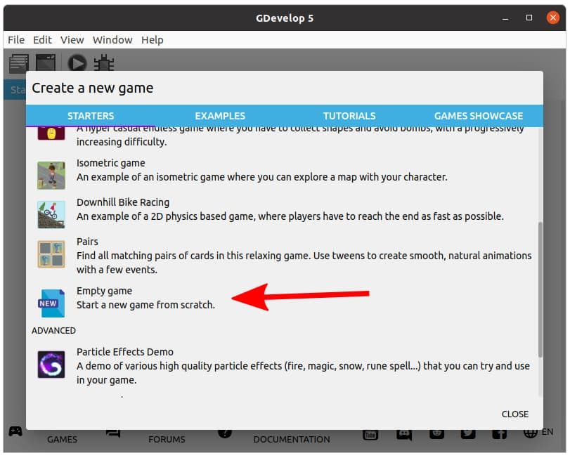
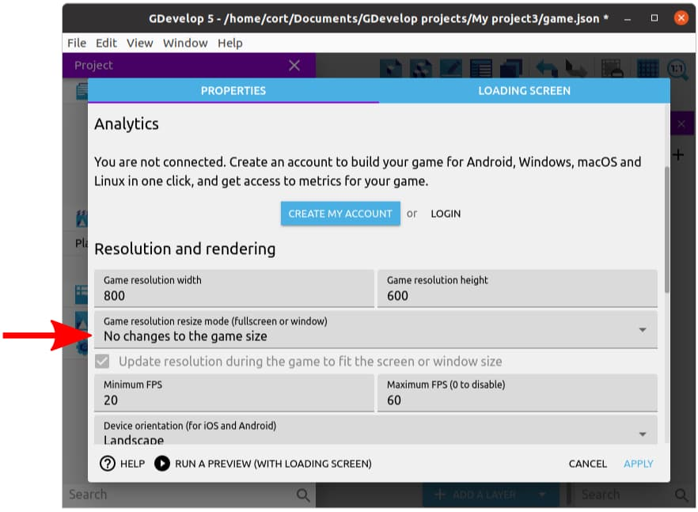

# Getting Started

Go ahead and open up GDevelop. If you're using the web-based editor, use this link [editor.gdevelop-app.com](https://editor.gdevelop-app.com).

You should see a window that looks like this...

Click on **CREATE A NEW PROJECT**...

Select **Empty game**...

Click on the **Project manager** icon...

You now have a completely empty project. Add a new scene and rename it to **Play** (...there's nothing special about this name, and you can use whatever you want).

We'll need to set a property for the game.
Open the project property window...

...and set **Game resolution resize mode** to **No changes to the game size**.
This ensures that the game window remains the same size regardless of your actual screen size.

Finally, click on the newly created scene to open it.