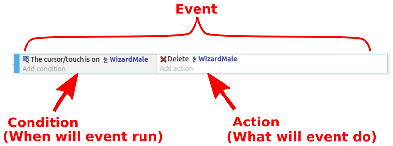
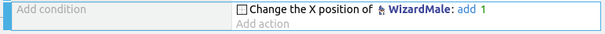
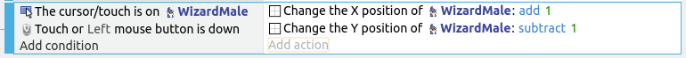
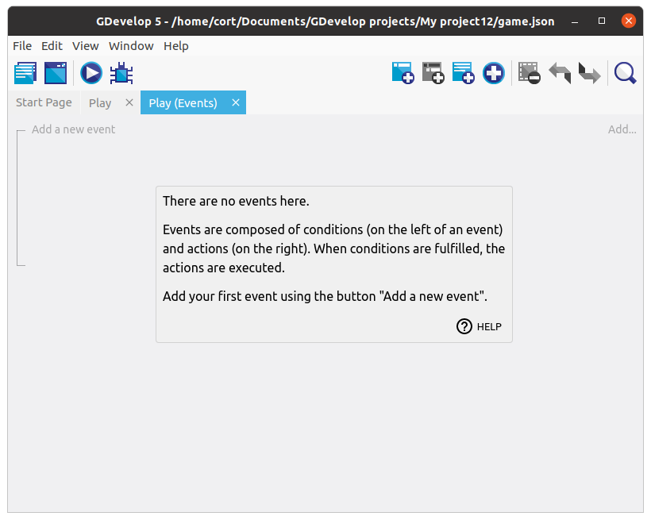
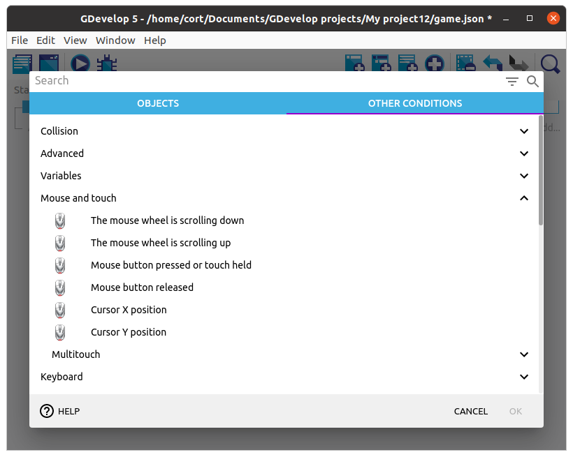
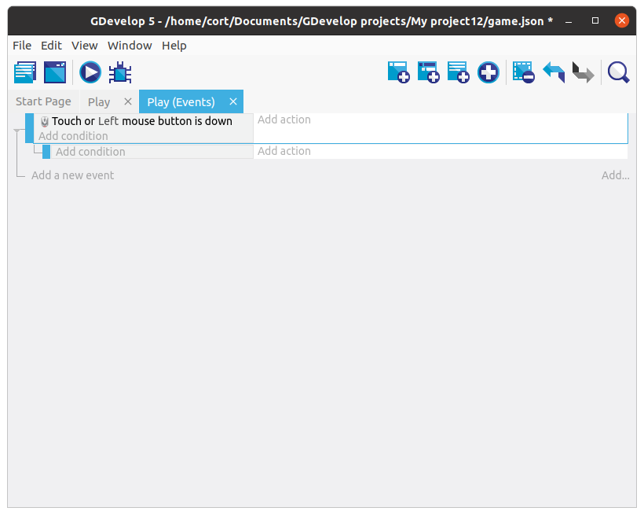

# Events

In GDevelop, events define the logic of a game.
If you have experience with Scratch, you would have used events before.

*Events in Scratch*

Each event in GDevelop, consists of **conditions** and **actions**.
**Conditions** define when the event will trigger and also select which object are affected by the action, while the **actions** define what happens when the event triggers.

If no conditions are defined, the associated actions will run every frame of the game (usually 60 times per second).

*Events with no conditions will run every frame*

Events may have multiple conditions and actions.
All the conditions must be true for the event to run.

## First Event

Switch to the events tab...

Then click on the **Add new empty event** button. You should now have a new event with empty conditions and actions.

Click on **Add condition**, click **Other conditions**, and select the **Mouse button pressed or touch held** condition.

Under **Button to check** select the **Left (primary)** button, then click **Ok**.

Your events tab should now look like this...

## Sub Events

That first event will detect when you touch the screen, but it can't tell which button was touched.
To do that, we'll add a sub-event under it to detect the buttons.
Sub-events are only considered when their parent event are true.

Select the first created event, and click the **Add sub-event to the selected event** button.

Make sure that the subevent is under the mouse button event.
If it is not, just drag it into place.

Next, click on the condition for the sub-event, select the **Up** arrow, then select **cursor/touch is on an object** condition.
Click **Ok**.

## Action

Now we'll add an action for the sub-event.
When the **Up** arrow is pressed, we want it to simulate an **up** keypress.

Under the sub-event, click **Add action**, select the player, then select the **Simulate up key press** action.
Click **Ok**.

Your events tab should now look like this...

## Add the rest

Repeat the steps, adding a sub-event for each direction.
When you're done, your events tab should look like this...

## Preview the Scene

At this point, you can preview the scene by clicking the **Preview** button.

Test the controls and make sure that your player character is moving correctly.