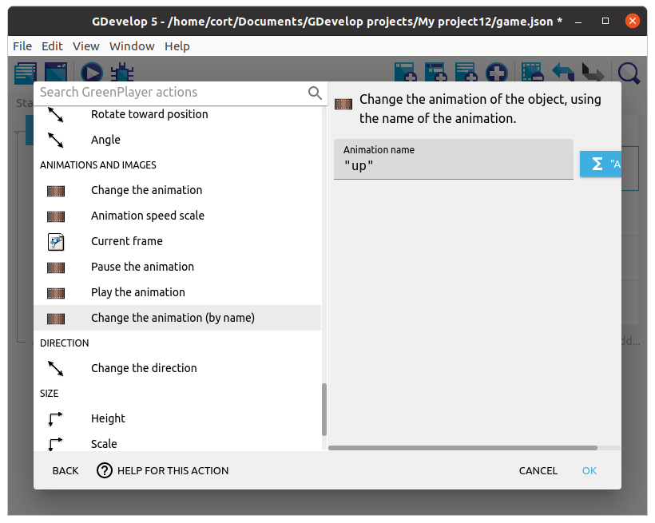
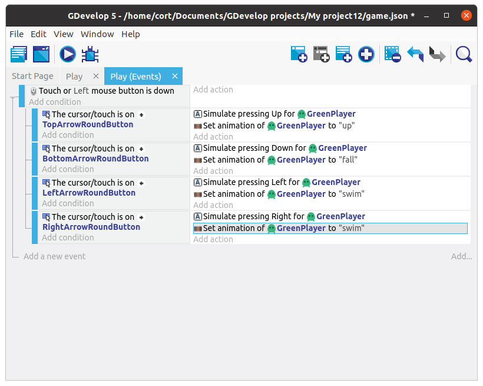
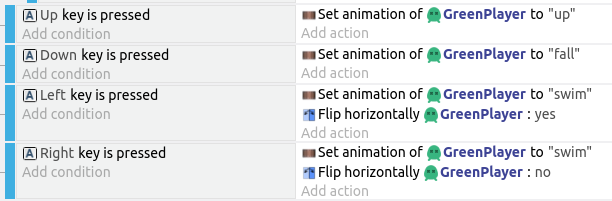
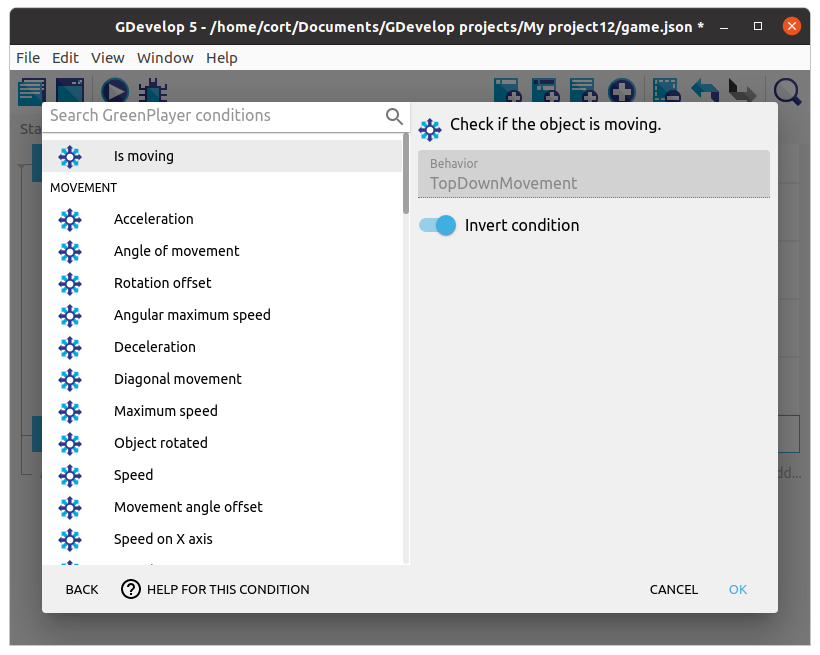
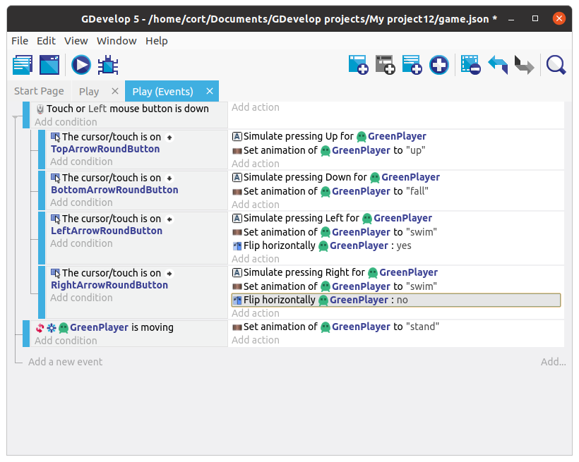

# Animation

The player character we've selected comes with 10 animations, but currently, we are only seeing the first **dead** animation (...which only has a single image, so it's not actually animating at all).

To do that, we'll need to add a new **Change animation** action, but first, let's check out what animations we have available.

Double click the player to open its object window. You should see a list of 10 animations.

You can preview the animation using the **preview** button, try it now with **#6 swim** animation.
If it looks like it's too fast (...it is), change the FPS until it looks right.
I think an FPS of 10 looks good, but it's your game, so you decide.

I'll be using the **#6 swim** animation for left and right movement, the **#8 up** animation for up, and the **#2 fall** animation for down.
Make sure the animation FPS is ok for all of these.

## Change Animation

Now we'll need to change the animation depending on which direction the player is moving towards.
We'll make use of the sub-events that we have already created (...the ones with the **Simulate pressing** actions), and add an additional **Change animation** action.

Click on the **Add action** under **Simulate pressing Up**.
Select the player, then choose the **Change the animation (by name)** action.
Under **Animation name** type in **"up"** (...including the double quotes and make sure it's in the correct case).
Click **Ok**

Continue adding the **Change animation** action for the remaining controls.
When done, your event tab should look like this...

## Change Animation (Optional: For keyboard controls)

Now your player should animate when controlled using the on-screen buttons, but not when the keyboard is used.
That's because the conditions for the animations are based on the on-screen buttons only.

Let's add in some events to change the animation when the arrow keys on the keyboard are pressed.

Start by adding a new event (...not a sub-event), and click on **Add condition**.
Select **Other Conditions**, **Key Pressed**, then under **Key**, set it to **Up**.
For the action, you can copy and paste in the action from the earlier on-screen buttons event.

Continue adding events for all the keys (up, down, left, right).
When done, your event tab should contain this...

## Idle and Flip

If you test it out now, you'll notice two problems.

* Player continues using the last animation even when nothing is pressed.
* Player faces the wrong direction when moving left

To fix the first problem, we'll switch to the **stand** animation if the player isn't moving.

Start by adding a new event (...not a sub-event), and click on **Add condition**.
Select the player, then the **Is moving** condition.
Since we want to perform the action when the player is **NOT** moving, we'll need to **Invert the condition**.

Under the action, add a **Change the animation (by name)** action and set the **Animation name** to **"stand"**.
It should now look like this...

Next, we'll need to flip the player around when moving left.

Add a new action under the move left event, click on the player, then select the **Flip horizontally**.
Under **Activate Flip**, select **Yes**.

Now do the same for the move right event, but set **Activate Flip** to **No**.
Your events should now look like this...

