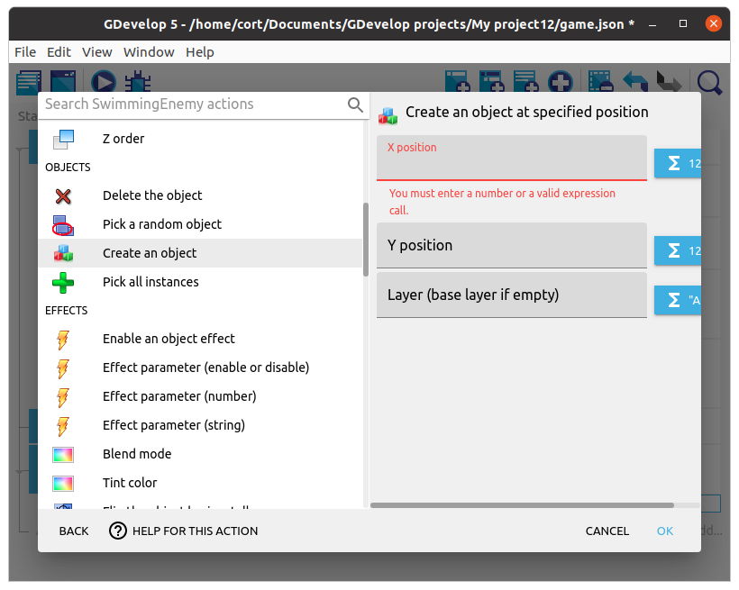
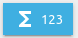
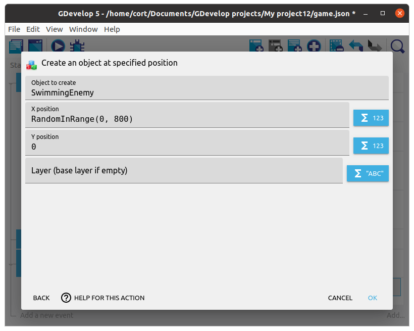
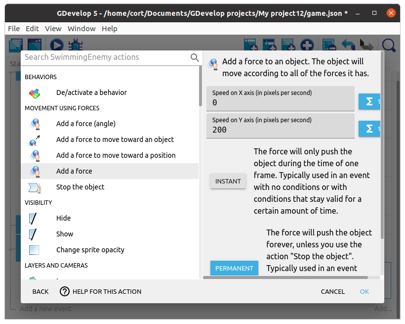
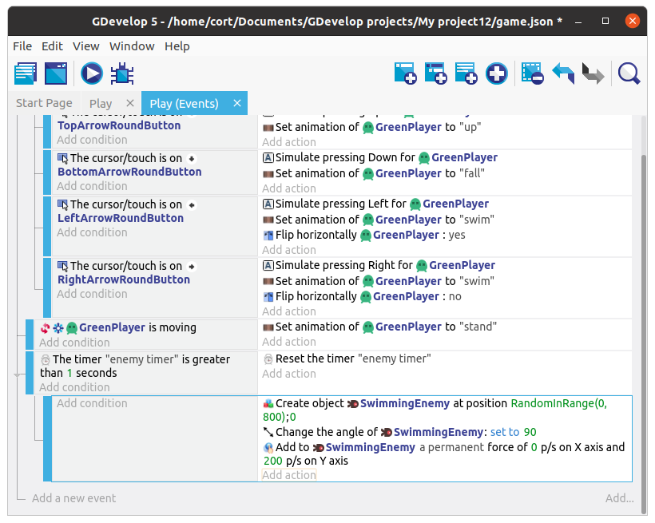

# Enemies

Time to add the enemies!
Add a new object, and select an suitable object to be your enemy.
I'm using the **Swimming enemy** object...

As before, preview the animation and adjust the animation speed.

## Create object action

Unlike the player and the arrow buttons, we can have many instances of the enemy, and we won't know exactly when or where they will appear.
So instead of dragging them on to the scene, we'll use a **Create object** action to create the enemy instances.

## Timer

For this game, we want to create a new enemy every 1 second.
To do that, make use of a timer, and everytime the timer exceeds 1 second, we'll...

1. Reset the timer (...back to zero).
2. Add a new enemy at a random position.
3. Rotate the enemy around (...so it faces the correct direction).
4. Add a force to the enemy (...to make it move).

Start by adding a new event.
Click on **Add condition**, select **Other Conditions**, then **Value of a scene timer**.
Set the **Time in seconds** to **1**, and the **Timer's name** to **enemy timer** (...nothing special about this name; you can use a different name if you want).
For the action, select **Others**, then **Start / Reset a scene timer**, and set the timer name to **enemy timer**.

Next, add a sub-event under the timer event.
Leave the condition blank, and add an action.
Select the enemy, then the **Create an object** action.

Finally, we will need to start the timer when the scene begins.
Add a new event, click on **Add condition**, select **Other Conditions**, then **At the beginning of the scene**.
For the action, select **Others**, then **Start / Reset a scene timer**, and set the timer name to **enemy timer**.

## Expressions

We want the enemy to appear at a random **X position** at the top of the screen.
To do that, do not key in a value for the **X position**, instead click on the expressions button next to it. 

Select the **Random integer in range** expression, and set the range **0 to 800**. Click **Apply**

For the **Y position**, set it to 0. This will make our enemy start at the top of the screen.

## Screen Dimensions and Coordinates

Previously, we set the random range to **0 to 800**, this is because the default dimension of the game screen is 800 (width) by 600 (height).
You can see (...and change) these by clicking the **Project Manager** button, selecting **Game settings**, then **Properties**.

We also set the **Y position** to 0 when we want the enemy to appear at the top.
This is because unlike in math, for most computer graphics software, the Y axis is pointed downwards, and the origin is at the top left corner of the screen.

## Rotate the enemy

To rotate the enemy, add a new action, click on the enemy, and select the **Angle** action.
Set the **Modification's sign** to **= (set to)** and the **Value** to **90**.

## Move the enemy

To rotate the enemy, add a new action, click on the enemy, and select the **Add a Force** action.

Since we want the enemy to move downwards (positive Y direction), set the **Speed on X axis** to **0** and the **Speed on Y axis** to **200**.
Also set the force type to be **Permanent**.
If we set it to **Instant**, we'll have to keep applying the force every frame or the enemy will stop moving after a short while.

Your events should now look like this...

## Preview

Test out your game.
You should see the enemy randomly appear and drop down from the top.