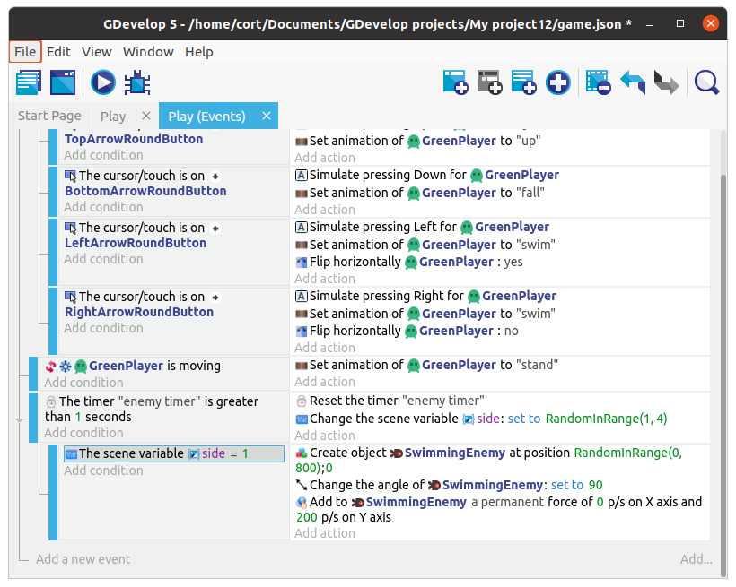

# Four sides

Now that we have the enemy appear from the top, we can easily modify the actions to make it appear from the bottom (...change the starting **Y position** to 600, and the **Y force** to **-200**).
Similarly, it's not hard to make it appear from the left or right.
But what if we want the enemy to pick a random side each time it appears?

## Variables

To do that, we'll...

1. Pick a random number from 1 to 4 and save it in a **Variable**.
2. Depending on the value in the variable, we'll set the starting position, angle, and force for the enemy.

A variable allows you to store **data**, such as a number or a text.
Think of a variable as a type of box; you can label the box with a name, then place or retrieve things from the box.

Right under the **Reset Timer** action, add a new action, choose **Other Actions**, then select **Value of a scene variable**.
Under **Variable**, type in **side** (...nothing special about this name, you can use a different name if you prefer).
Under **Modification's sign**, select **= (set to)**, and under **Value**, select **RandomInRange(1, 4)**.

## Conditions with Variables

Previously, we left the conditions for timer sub-event blank (...that's the one with the add enemy actions).
Now, we'll add in a condition, click on **Add condition**, **Other conditions**, and select **Value of a scene variable**.
Under **Variable**, type in the same name we've used earlier (...**side**), under **Sign of test**, select **= (equal to)**, and under **Value to compare**, type in **1**.

Now your events should look like this...

## All Four Sides

Make 3 more copies of the add enemy sub-event, and modify them so that each of them will...

1. Check for a different number in **side**
2. Start the enemy on a different random side.
3. Set the rotation according to the side it is on.
4. Set the force according to the side it is on.

It should look something like this...

You can copy and paste an event, but it can be a little tricky to get it right.
If you're on a computer, right click on the event.
If you're on a tablet, tap and hold on the event.  

The tricky bit is that you must click / hold on to an area without any conditions or actions, else you'll end up copying the conditions / actions instead.
Best place to click / hold is at the very bottom of the event, to the right of the "Add condition".  

If you've done it correctly, you should see an option to "Toggle disabled". If you don't see this option, you must be on a condition or action.

