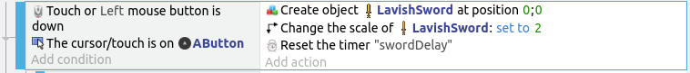
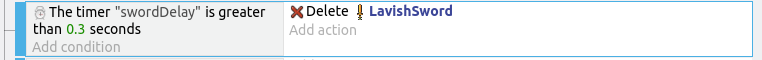
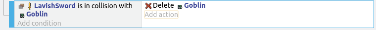

# Attacks

To inflict acts of violence on the monsters, we'll add in a sword for our player.
I'm using the **Lavish Sword**...

Add it to the game, but don't drag it into the scene; we'll be adding it using events instead.

## Attack Button

We'll need a button to trigger the sword attack.
I'm using the **A** button...

Drag it into the scene and set the layer to **GUI**.
Your scene should now look like this...

## Attack Event

Whenever the **A** button is pressed, we want...

1. Sword should appear in the direction the player is facing.
2. Sword should remain for a fraction of a second.
3. If any monsters touches the sword, the monster should be deleted.
4. There should be a slight delay before the player can attack again.

We'll start with a new group event, and name it **Player Attack**.

Add a sub-event, and for condition, select **Mouse button pressed or touch held** and choose the **Left** mouse button.
Add a second condition in the same sub-event, this time select the **A** button and choose **cursor/touch is on object**.

For the action, select the **Sword** and choose **Create an object**.
The **X** and **Y** position doesn't matter, as we'll be changing it in a separate action, so just set them to zero.

We'll also need to make the sword a little larger, so add a second action, select the sword, and set **Scale** to **2**.

## Attack Direction

Next, we need to determine the direction that the player is facing, so we'll need to add 4 sub-events.
These sub-events will check which animation the player is currently set to.

For the first condition, select the player and choose **Current animation**.
Set the sign to **= (equal to)** and value to **0**.
For the action, select **Value of scene variable**, set the name to **playerDirection**, and set the value to **90**.

In the sprite I'm using, animation 0 is a downwards movement, hence the playerDirection is set to 90 (south).
You may need to use other values if you are using a different sprite.

Repeat for all 4 animations / directions.

## Position and Rotate Sword

Select the **Player Attack** event and add a sub-event to that.

For this new sub-event, leave the condition empty.
For the actions, select the **Sword** and choose **Put the object around another**.
Choose the player as the center object.
For distance, choose 50.
For angle, click on the **Expressions** button, select **Value of scene variable**, and provide the name **playerDirection**.

Add a second action, select the **Sword** and choose **Angle**.
Set the sign to **= (set to)** and the value to **Expressions**, **Value of scene variable**, and **playerDirection**.

## Remove Sword After Delay

To remove the sword after a short delay, we'll need a timer.
Add a new action to the **Touch or mouse down** event, select **Other Actions** and choose **Start (or reset) a scene timer**.
Give the timer the name **"swordDelay"**.

Select the **Player Attack** event and add a sub-event to that.
For the condition, select the **Other Conditions** and **Value of scene timer**.
Set the timer name to **"swordDelay"**, and time in seconds to **0.3**.

For the action, select the **Sword** and **Delete the object**.

## Delay Before Next Attack

To impose a short delay after each attack, add a new condition to the **Touch or mouse down** event.

For the condition, select **Other ACtions** and **Value of scene timer**.
Set the timer name to **"swordDelay"**, and time in seconds to **0.6**.

## Removing the Monster

To remove the monster when the touch the sword, add a new sub-event under **Player Attack**.
For the condition, select the **Sword**, **Collision**, and choose the **Goblin**.
For the action, select the **Goblin**, and choose **Delete the object**.

## Events Summary

If you have added all the events correctly, it should look something like this...

