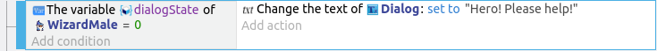
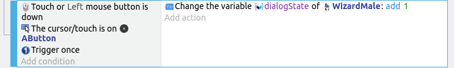
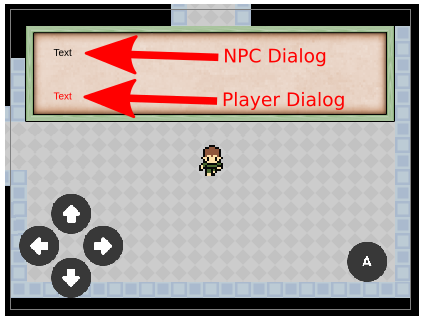
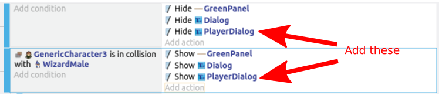
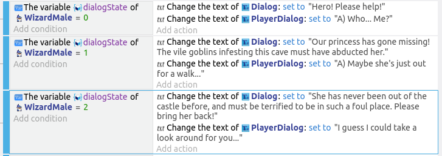

# Dialog (Part 2)

Our earlier dialog for the wizard is pretty simple; just a single fixed line.
Now we're going to expand on it with multiple lines and responses from the player, but this will still remain a very basic dialog system; linear with no branches.

The branching dialog often seen in most RPG games can take a lot of effort and time to create.
Even disregarding the coding work, every branch can increase the number of dialog lines exponentially.
To give an example, the 2011 game Skyrim, has 60,000 lines of dialogs, yet most players will have seen only a small fraction of them; the rest of the dialog are in branches that the player did not choose.

 

If you do decide to create branching dialog for your GDevelop game, it is best to learn and use a purpose made tool like the "Dialog Tree" extension.

These are what we'll be adding to the dialog system, and how we will achieve it...

* Multiple lines of dialog
    * Use an instance variable to keep track of which line of dialog we are at
    * Increment the variable when the player press the **A** button
* Responses from the player
    * Use a second text object to display the player's response
    * Check the instance variable to determine which line to say

## Multiple Lines of Dialog

We'll start by modifying the Wizard to have multiple lines of dialog.
Let's have him speak these three lines.

1. "Hero! Please help!"
2. "Our princess has gone missing! The vile goblins infesting this cave must have abducted her."
3. "She has never been out of the castle before, and must be terrified to be in such a foul place. Please bring her back!"

Currently, under the **Dialog** group event, you should have a set of events that looks like this...

Add a condition to the second event.
Select the **Wizard** and **Value of an object variable**.
Set the variable name as **dialogState**, operator as **= (equal to)**, and value as **0**.
Next, change the dialog to the first line.

Repeat for the other two lines of dialog, but set the checks for the **dialogState** value to **1** and **2**.

## Progressing through the Dialog

Now when you touch the wizard, he will only speak the first line of dialog.
To progress through the remaining two lines, we'll need to change the value of **dialogState**.
We'll use an event to detect if the **A** button is pressed, and increment **dialogState** if it is.

Select the **Collision with wizard** event, and add a sub-event under it.
For the conditions, add...

* **Touch or mouse button down**
* **Cursor / touch is on A Button**
* **Trigger once** (...this is found under **Other conditions**, **Advanced**)

The last condition "Trigger once", ensures that the event is only triggered a single time when you click and hold the A button.
Without this condition, the event will trigger 60 times a second as long as the A button is held down.

For the action, select the **Wizard** and **Value of an object variable**.
Set the variable name to **dialogState**, the modification sign to **+ (add)**, and the value to **1**.

## Responses from the Player

Start by creating a new **Text** object, and name it **PlayerDialog**.
Use a different font color to differentiate it from the NPC dialog, then place it within the dialog panel.

Just like the NPC dialog, we'll need to hide and show the **PlayerDialog**.
Look for the actions where we hide and show the NPC dialog, and add in actions to hide and show the **PlayerDialog** as well.

Now look for the events where we have the text of the wizard dialog, and add in actions for the player dialog.

The first two player dialog starts with an "A" to indicate that the player should press that button to progress.
The last dialog doesn't have the "A" as that's the last dialog line.

## Princess Dialog

Using the same method, add dialog for the princess.
Start by adding a sub-event under the **Dialog** group event.
This new sub-event should have the same conditions and actions as the existing **Collide with wizard** event (...but changed to **princess**).

One easy way is to simply copy and paste the wizard event, and change it to refer to the princess instead.
This will also copy all the sub-events under it.

Taking reference from the wizard dialog, create events for the princess dialog.
It's up to you to decide what her lines will be.