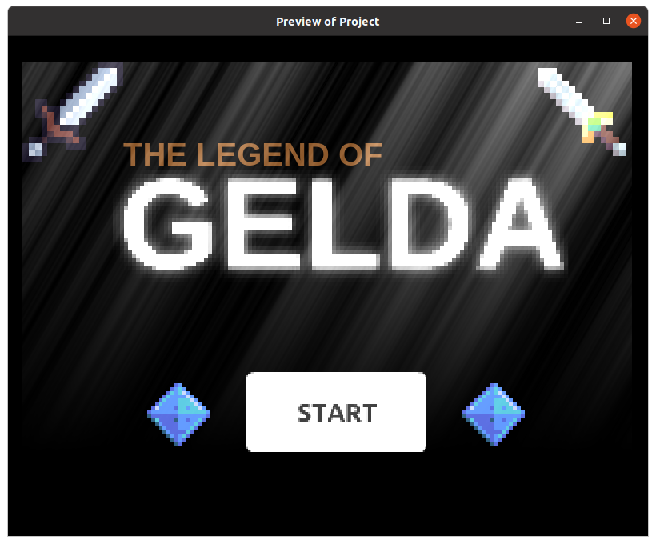

# Start and End Scenes

It's hard to create a nice looking start and end scene without the use of custom graphics, so I'll just be creating a very simple one here.
If you are using the desktop editor, you can create your own image in Photoshop / Gimp / Inkscape / etc, and import it into your game.

Add a new scene, rename it to **Start** and move it to the top of the scene list.

Running an exported game will always start the first scene in the list.

Add a new **Text** object, give it the initial text **GELDA** and set the color and font.
Drag an instance on to the scene and position it suitably.

Add a start button to the scene.
Size and position it suitably.

**Optional:** Add more text and images to decorate your start scene.

This is what mine looks like...

## Effects

Effects changes appearances, such as changing the color into black and white, blurring the screen, or making an object glow.
They can be applied to an object, or to an entire layer.

We'll apply the **Godray** effect on the **Base Layer**, and the **Pixelate** and **Advanced Bloom** effect on the title object.

Starting with **Godray**, click on the **Layer effects button**.

Click on **Add Effects**, and under **Choose the effect to apply**, select **Godray**.
Experiment with the parameters if you like, then click **Apply** when you are done.

Effects only appear when running the game or a preview; you will not see any effects in the editor screen.

For the title object, click on the kebab menu then select **Edit Effects**.

First add the **Advanced Bloom** effect, then add the **Pixelate** effect.
For the **Pixelate** effect, I find that using a size of **5** looks best, but feel free to play around with any of the settings.

The order of the effects matters.
Try changing the order and see the difference.

 

The settings for the effects can be changed using events.
This can be useful to create an animated effect.

This is what my start scene looks like with the above effects applied.

## Start Scene Events

We'll add an event to make the start button work.

Add a new event, and set two conditions...

1. **Left mouse button released** (...under **Other conditions**)
2. **Cursor / Touch is on StartButton**

For the action, set it to **Change scene to "Play"** (...under **Other actions**).

## End Scene

Add a new scene and rename it to **Game Over**.

Add a new **Text** object, give it the initial text **GAME OVER** and set the color and font.
Drag an instance on to the scene and position it suitably.

Add a restart button to the scene.
I'm using a white **Blank Button** and placing on top of it a **Text** object with the words "Restart".

**Optional:** Add more text, images, and effects to decorate your start scene.

This is what mine looks like...

## End Scene Events

We'll add an event to make the restart button work.

Add a new event, and set two conditions...

1. **Left mouse button released** (...under **Other conditions**)
2. **Cursor / Touch is on BlankButton**

For the action, set it to **Change scene to "Start"** (...under **Other actions**).

## Losing

We'll have the player lose if he touches a monster.

To do that, we'll add an even that detect if the player is colliding with a monster.
If he is, we'll change the scene to the **Game Over** scene.

Switch back to the **Play** scene.
Add a new group event and name it **Game End**.

Under **Game End**, add a sub-event, and set the condition to **Player collision Goblin**.
For the action, select **Other Actions**, **Change Scene**, **"Game Over"**.

