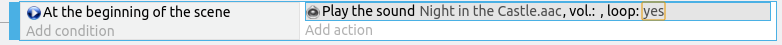

# Sound and Music

Let's add some background music.

When running on a browser, the user must interact with the game (eg. click on the screen) before the first sound/music is played.
This is a limitation imposed by the browser to prevent annoying websites from blaring loud sounds at you as soon as you open the webpage.

To play a sound, we'll use either the **Play Music** or **Play Sound** actions.
Use **Play Music** if it is a long file such as a background music, and **Play Sound** if it is a short one like for a gunshot sound.

If in doubt, use **Play Sound**; while it's intended for short sounds, it actually works well for audio of any length.

Add a new event. Add the condition **At the beginning of the scene**. Add the condition **Play the sound**, select a music that you like, and set **Repeat** to **Yes**. It should look like this...

Add a background music for the **Start** and **Game Over** scene in the same way.
Note that the background music for the **Start** scene will **NOT** play when you start the game in a browser, as the browser will not allow a webpage to play audio before the user interacts with it.
