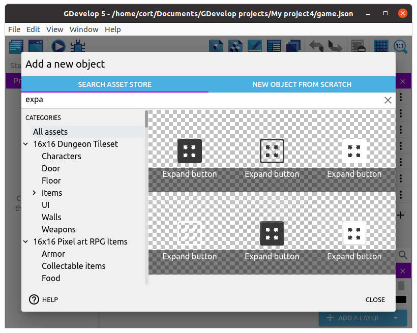
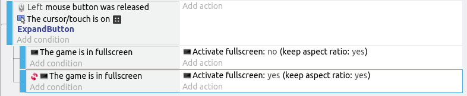

# Fullscreen

To enable fullscreen, first we'll need to add a button for it.
I'm using this one and adding it to the **Start** scene.

Next, we'll need to add the events to toggle the fullscreen.
The code here can be a little tricky, so I'm showing you the full event code here and explaining it a little further down...

What the code does is...

1. When the button is clicked, it first sets the **fullscreen** variable to **0**.
2. Then if the game is currently in fullscreen, it'll change **fullscreen** to **1**.
3. In the last two sub-events, if **fullscreen** is **1**, it'll turn fullscreen off, else it'll turn it on.

The use of the **fullscreen** variable may seem unnecessary, and some may propose this shortened version...

*WARNING: This will not work*

...but consider what happened if...

1. The game is in fullscreen, and...
2. The expand button is clicked.

The first sub-event will check if the game is in fullscreen, and since it is, it'll turn off fullscreen.
The second sub-event will then check if the game is NOT in fullscreen, and since it is not, it'll immediately turn on fullscreen again.

## More Fullscreen Buttons

Using the same method, add fullscreen buttons for the **Play** and **Game Over** screen as well.