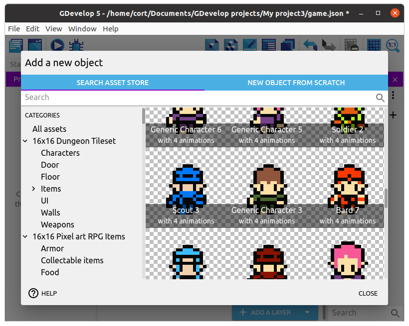

# Player

Open up the **Play** scene and click on **Add new object**, then from the asset store search for the **Generic Character 3** and add it to the game.
This character is from the **16x16 RPG Characters** category, and you can choose any character from that category.

Most of the character assets in the store are meant for platformer games, and won't be suitable as they lack an up / down animation.
If you are using the desktop editor, you can find many free assets online from sites such as [OpenGameArt](https://opengameart.org/).

## Adding Behaviors

Our game will be using a top-down orientation, so just as before, we'll add the **Top-down movement** behavior.
Double click on the player object, switch to the **Behaviors** tab, and click **Add a Behavior to the object**.

The **Top-down movement** behavior is installed by default, so you can just click to add it.
This behavior allows us to move the player using the arrow keys, and after adding it, you can tune the parameters (eg. speed and acceleration).
For now, just make sure the **Rotate object** option is disabled, and leave the rest of the settings alone (...or mess around with it. Experimentation is cool.).

## Adding an Instance

Drag the player character on to the scene.
It looks a little small doesn't it!
That's because this images is only 16 pixels tall and 16 pixels wide.
Fortunately, we can resize it...

Make sure **Custom size** is checked, and set both the **Width** and **Height** to 64, then position the player at the center of the scene.

