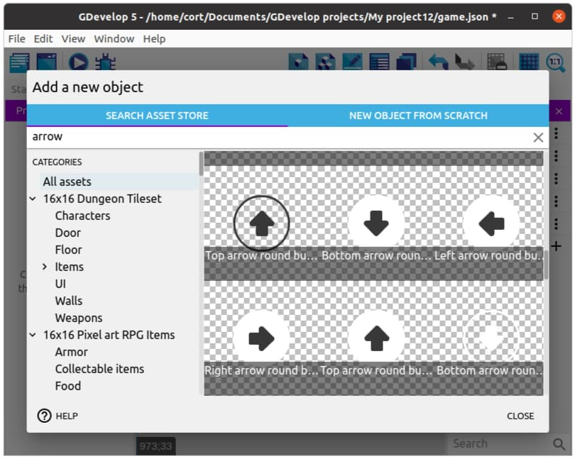
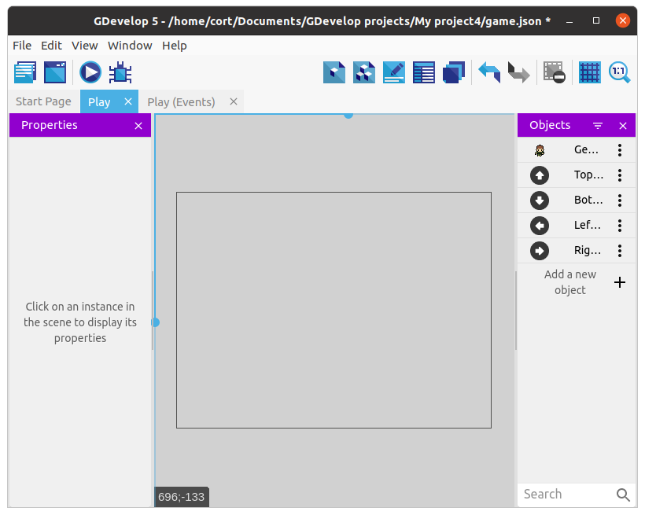
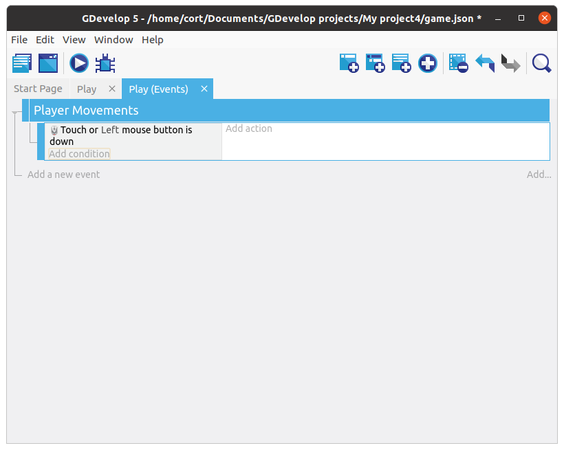
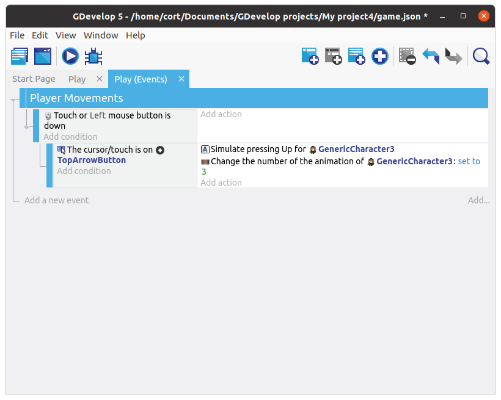
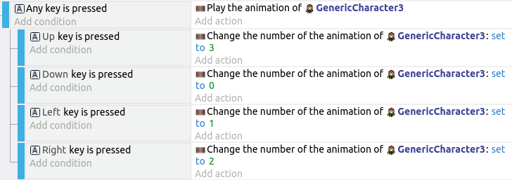

# Touchscreen Controls

The **Top-down movement** behavior allows you to control the player using the arrow keys on the keyboard, but if you're on a tablet, you (probably) won't have a keyboard!
To solve that, we'll add virtual keys to the screen.

If you're using a PC and don't intend for your game to be played on a touchscreen, you can skip adding the control buttons, but will need to modify the events to enable the correct animations.

## Control Buttons

Add a new object and select an up arrow. You can use whichever one you prefer.

Continue adding arrows until you have one in each direction.

Drag one instance of each arrow into the scene, and for each arrow...

1. Change the size to something appropriate (...if required).
2. Position it like in the following image.

## Group Events

In **Dodge the Creep**, we only used **Standard Events** and **Sub-Events**.
That works fine, but as we have more events, things starts to get messy.

**Group Events** are used to organize and structure our events.
By themselves, they have a title, but otherwise do nothing at all.

**Group Events** are only useful when we add sub-events to them.
This lets the group event act like a header for a group of events.
For example, we can create a group event with the title "Enemies" and place all the events related to the enemies under this group.

Let's start by creating a group event, and naming it "Player Movements".

Next, select the group event and add a new sub-event.
For this first sub-event, we'll be adding the **Mouse button pressed or touch held** condition.
Under **Button to check** select the **Left (primary)** button, then click **Ok**.

Your events tab should now look like this...

This first event will detect when you touch the screen, but it can't tell which button was touched.
To do that, we'll add a sub-event under it to detect the buttons.
Select the **Touch or mouse down** event, and add another sub-event.

For the conditions, select the **Up** arrow, then select **cursor/touch is on an object** condition.
And for the action, select the player, then select the **Simulate up key press** action.

We should also set the correct animation for each movement direction, so go ahead and add a **Change the animation** action.
Check the player object to determine what is the correct animation name / number and set it accordingly.

Your events tab should now look like this...

## Add the rest

Repeat the steps, adding a sub-event for each direction.
When you're done, your events tab should look like this...

## Pause and Play animation

In our previous game, we switched to an idle animation when the player isn't moving.
For our current player sprite, we don't have an idle animation, so instead, we'll pause the animation when the player is stopped.

Add a new sub-event under the **Player Movements** group event.
For the condition, select the player, choose **Check if the object is moving**, and set it to **Invert condition**.
For the action, select the player, then choose **Pause the animation**.

Since we have paused the animation, we'll also need to restart it when the player is moving.
Add a **Play the animation** action to the existing **Touch or mouse down** event.
Our event tab should now look like this...

## Animate Keyboard Controls (Optional)

Now your player should animate when controlled using the on-screen buttons, but not when the keyboard is used.
Let's add in some events to change the animation when the arrow keys on the keyboard are pressed.

Start by adding a new event (...not a sub-event), and click on **Add condition**.
Select **Other Conditions** then **Any Key Pressed**.
Choose the **Play the animation** action, same as the previous section.

Continue adding events for all the keys (up, down, left, right).
For each of the key pressed event, select the corresponding **Change the animation** as from the previous sections.
When done, your event tab should contain this...

