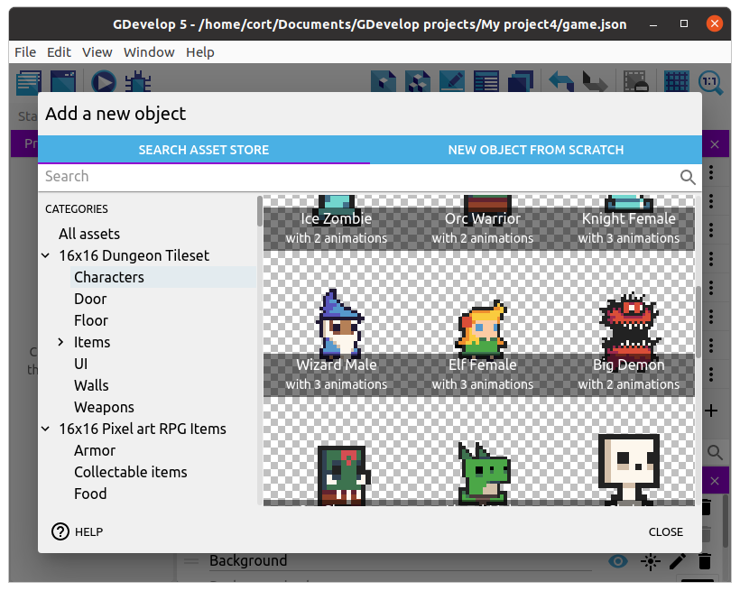
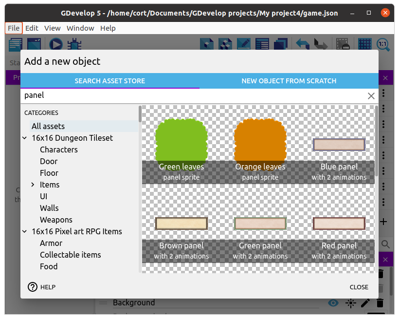
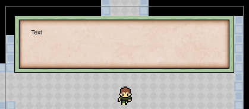
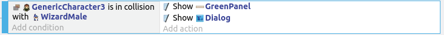
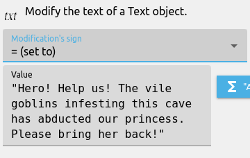

# Non-Player Characters

You can't have an RPG without Non-Player Characters (NPC).
We'll start with a Wizard (...or whatever you prefer); he'll be the one to give us our quest.

Unlike the player, this NPC don't need to move around.
This means that we don't need to choose a sprite with up/down/left/right animation, allowing us a lot more choices.

Drag an instance of the wizard on to the scene, resize him, and set an appropriate animation (...I'm using animation 1, "Idle").

## Dialog

We'll need to provide a dialog box, so add a suitable sprite (...I'm using **Green Panel**).

Resize and position an instance of the panel in the scene, and set the layer to **GUI**.

Next, add another new object, this time select **New Object from Scratch** and choose **Text**.
Name the new object **Dialog**, and fiddle around with the font and color if you like.
No need to change the default text (...we'll change it in the events).

Drag an instance of **Dialog** on to the scene, set the layer to **GUI**, then position it suitably within the dialog panel.

## Dialog Events (Part 1)

We want our dialog to do a few things...

1. Hide when the player is not touching an NPC
2. Appear when the player touches an NPC
3. Show dialog from the NPC

It's not much for now, but we'll make it do a little more in dialog part 2.

### Hide when not touching NPC

We'll start by adding events to hide the dialog when the player is not touching an NPC.

To keep things organize, start by creating a group event named **Dialog**.
Add a sub-event to **Dialog**, and for the action, select the **GreenPanel** and choose **Hide**.
Add a second action to hide the **Dialog** object.

### Appear when touching NPC

Add another sub-event to **Dialog**.
For the condition, select the player, choose **Collision**, then the **Wizard**.
Add two actions to **Show** the **GreenPanel** and the **Dialog** object.

### Show dialog from the NPC

Select the **Collision with Wizard** event, and add a sub-event to that.
For this sub-event, we can leave the condition blank.
For the action, select **Dialog**, **Modify the Text**, set the **Modification Sign** to **= (set to)**, and type in a dialog of your choice.

This is what I'm using...

Be sure to put double quotes **(")** around your text.

### Testing and Touch-up

Test it out.
The dialog box should appear when your player touches the wizard, but the text may be too long.
To fix that, we need to set the wrapping options for the text object.

Add a new sub-event under **Dialog**.
We only need to set the wrapping options once, so for the condition, select **Other Conditions** and **At the beginning of the scene**.
For the actions, select the **Dialog** object, and set **Wrapping** to **Yes**.
Add a second action, select the **Dialog** object, and set **Wrapping Width** to **600** (...or whatever you prefer).

