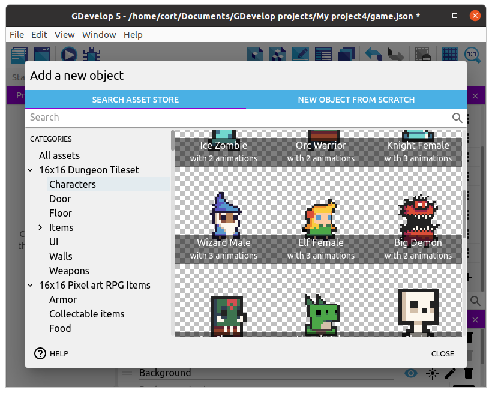
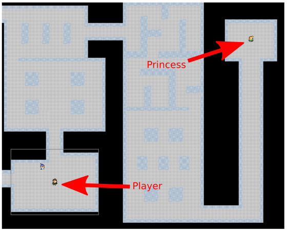
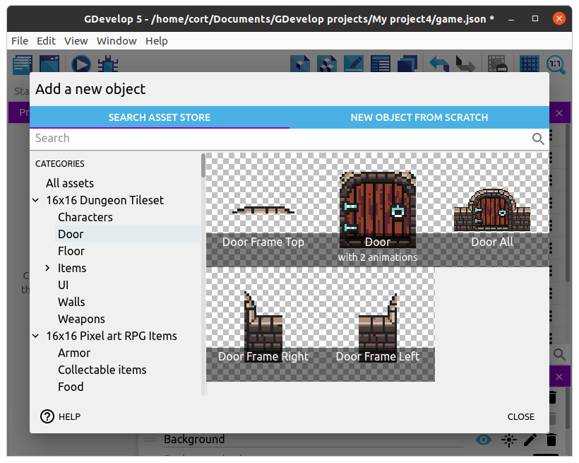
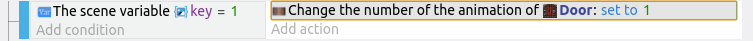
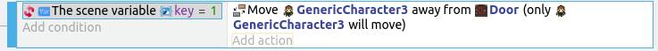

# Princess NPC

Now let's add a second NPC; the princess.
I'm using the **Elf Female** sprite, but as always, you can choose what you want.

Rename the object to **Princess**, drag an instance of her on to the scene, resize her, and set an appropriate animation.
For me, I'm placing her in a distant room.

## Door

It'll be too easy if we can just walk straight up to the princess, so let's put her behind a locked door.
I'm using this sprite...

Add it to your game, drag an instance on scene, resize, then position the door somewhere suitable.

## Key

To unlock the door, we'll need a key...

Choose a suitable key, add it to your game, and drag an instance on scene.

## Events for Key

This is what we need the key to do...

1. When touched, it should disappear.
2. The game should remember that the player has picked up the key.

Start by creating a group event named **Key**, then add a sub-event to it.
For the condition, select the player, **Collision**, then choose the **Key**.
For the action, choose the **Key**, then **Delete object**.

To remember that the player has picked up the key, we'll need to set the value of a **Variable**.
Add another action to the previous event, select **Other Actions**, **Variables**, **Value of a scene variable**.
Give the variable the name **key**, set the sign to **= (set to)**, and set the value to **1**.

## Events for Door

This is what we need the door to do when it is touched...

1. If the **key** variable is **1**, it should change to the **Open** animation.
2. If the **key** variable is **NOT 1**, it should move the player away from the door.

Start by creating a group event named **Door**, then add a sub-event to it.
For the condition, select the player, **Collision**, then choose the **Door**.
Don't set any actions for this, instead, add two more sub-events to this sub-event.

In the first sub-event, set the condition to **Other Conditions**, **Variables**, **Value of Scene Variable**.
Set the variable name to **key**, sign to **= (equal to)**, and value to **1**.
For the action, choose the **Door**, select **Change the animation**, then **= (set to)** a value of **1**.

For the second sub-event, use the same condition as the first, but set it to **Invert Condition**.
For the action, choose the player, select **Separate objects**, then choose the **Door**.

