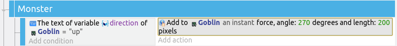
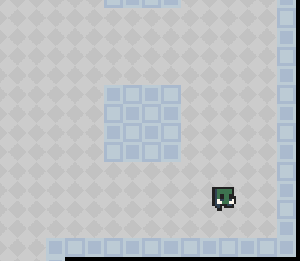
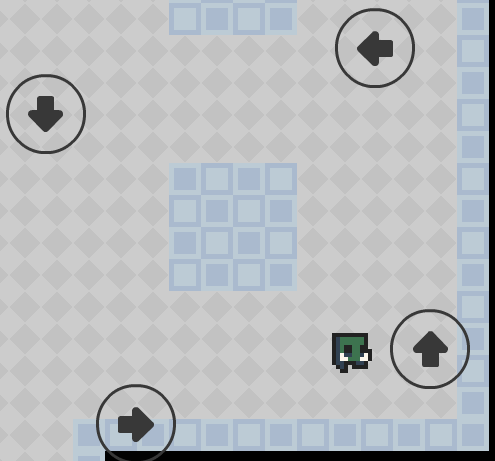
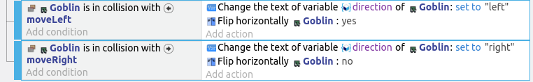
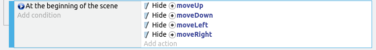

# Monsters

The wizard mentioned an infestation of vile goblins, so let's add them in.

I'm using this goblin, but use whatever you like...

Drag an instance of the goblin to a suitable location, resize it, then set an appropriate animation (...I'm using animation 1, **Run**).

## Monster Behavior

For this game, we'll only have a very simple monster behavior.
The monster will move in a perpertual loop, and won't attempt to chase the player.

## Instance Variables

Each instance of the monster needs to remember which direction it is moving towards.
To do that, we'll make use of an **Instance Variable**.
Unlike **Scene Variables** which are the same for all objects in the scene, an **Instance Variable** is different for every instance.
This allows us to have multiple monsters, each moving in a different direction.

Select the monster, then click on **Instance Variable**...

Add a new **Instance Variable**...

...set the name to **direction**, and the value to **right**.

Click **Apply** when you are done.

Together with some events, this will make this monster move to the right.

In GDevelop, the terms **Object variable**, **Instance variable**, and **Object instance variable** are used interchangeably.

## Movement Events

Start by adding a new group event and naming it **Monster**.
Add a sub-event, and for the condition, select the **Goblin** and **Text of an object variable**.
Set the variable name to **direction**, sign to **= (equal to)**, and value to **"up"**.

For the action, select the **Goblin** and **Add a force (angle)**.
Set the angle to **270** degrees, and the speed to **200**.

Repeat for the other 3 remaining directions.

In GDevelop, 0 degrees is East, 90 degrees is South, 180 degrees is West, 270 degrees is North.

## Hidden Arrows

To tell the monsters which way to turn, we'll make use of some hidden objects.
Add 4 arrow objects, one for each direction, and rename them to **moveUp**, **moveDown**, **moveLeft**, and **moveRight**.
What image you use for the arrow won't matter much, as they'll be hidden at the start of the game.

Here I have a goblin, and I want the goblin to move around the pillar in a counter-clockwise direction....

I'll add in the arrows pointing towards the direction I want the goblin to turn to.

Keep in mind that the goblin will turn as soon as it touches the arrow.

## Turn Events

Add another sub-event to the **Monster** group event.
For the condition, select the **Goblin**, **Collision**, and choose the **moveUp** object.
For the action, select the **Goblin** and **Change text of variable**.
Set the variable name to **direction**, sign to **= (set to)**, and value to **"up"**.

Repeat for the other 3 remaining directions, then test it out and make sure the monster is moving correctly.

## Facing Direction

You may have noticed that the monster is still facing right even when it is moving left.
To fix that, we'll need to modify the **Collision with moveLeft** event, by adding a **Flip horizontally yes** action.

We'll also need to flip the monster back when it is moving right, so add a **Flip horizontally no** action to the **Collision with moveRight** event.

## More Monsters!

Now that you have the first monster working, continue to add more monsters throughout the game world.
This is what mine looks like...

## Hide Arrows

Once you have tested it out and made sure everything is working correctly, we'll add an event to hide all the turn arrows.

For the condition, set it to **At the start of the scene**.
For the action, select the **moveUp** object, and choose hide.
Repeat for all the 4 arrows.

